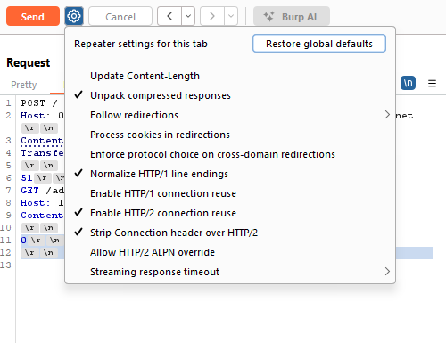

## Lab: Exploiting HTTP request smuggling to bypass front-end security controls, TE.CL vulnerability 

Steps:

1. Create two requests in Repeater: attack request and normal request. In both requests, must select "show non-printable" chars.

The attack request should look like this:


The normal request should look like this:


Checklist before you launch the attack:

- In "Request attributes": downgrade both requests to HTTP/1. (instead of the default HTTP/2)
- For both requests, you must use your own lab ID in the Host header. 
- In attack request, deselect "Update Content-Length", because we set the content-length manually, we do not want burp suite to automatically set it.



2. Attacker: launch attack: send the attack request and then immediately send the normal request. The lab should be solved.

## Explanation

1. Why the first Content-Length (in the attack request) is 4?

Because we want to back end to interpret this part as the body of the first HTTP request: 51\r\n. Here we have 4 characters: '5', '1', '\r', '\n'.

The HTTP specification requires the value to be: a base-10 (decimal) integer representing the exact number of bytes in the HTTP message body.

2. How about line 5? Why do we have \r\n in line 5 in the attack request?

RFC 7230 §3 says: Each header line ends with CRLF. The end of the header section is indicated by a CRLF line — meaning a blank line. After that blank line, the message body (if any) begins. Thus, the end of the headers is marked by a double CRLF:

```
Header-Name: value\r\n
Header-Name: value\r\n
\r\n   <-- this empty line is required
<body starts here>
```
3. In the attack request, why in line 6 we have 51?

51 is the chunk size. We want the front end to interpret everything in between line 7 and line 9 as the chunked data. This part is exactly 81 characters, and decimal 81 is 0x51. The chunk size must always be in hexadecimal format, as required by the HTTP/1.1 specification (RFC 9112, formerly RFC 7230 and 2616).

```plaintext
GET /admin/delete?username=carlos HTTP/1.1\r\n
Host: localhost\r\n
Content-Length: 88\r\n
```

According to the RFC:

- Newline characters after the chunk size line does not count toward the chunk size. This is why the \r\n in line 6 (right after 51) does not count.
- Newline characters after the chunk data does not count in the chunk size. This is why the \r\n in line 10 does not count.
- Any newline characters (\n or \r\n) that are part of the actual chunk data do count. This is why the \r\n in line 7, line 8, line 9, do count.

4. In the attack request, why the second Content-Length is 88?

We want the back end to interpret line 11, line 12 and all the lines in the normal request as the body of the second HTTP request. line 11 and line 12 contains 5 characters: '0', '\r', '\n', '\r', '\n'. The normal request has 3 lines, in line 1, line 2, line 3, there are in total 83 characters. And thus 83+5=88 characters. That' why the second content length header in the attack request has a value of 88.


