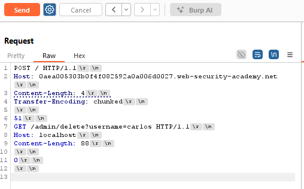
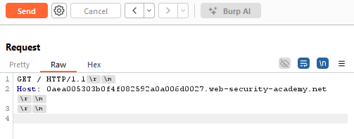

## Lab: Exploiting HTTP request smuggling to bypass front-end security controls, TE.CL vulnerability 

Steps:

1. Create two requests in Repeater: attack request and normal request.

The attack request should look like this:

The normal request should look like this:

Checklist before you launch the attack:

- In "Request attributes": downgrade both requests to HTTP/1. (instead of the default HTTP/2)
- For both request, you must use your own lab ID in the Host header. 
- Must select "show non-printable" chars.

2. Attacker: launch attack: send the attack request and then immediately send the normal request. The lab should be solved.
