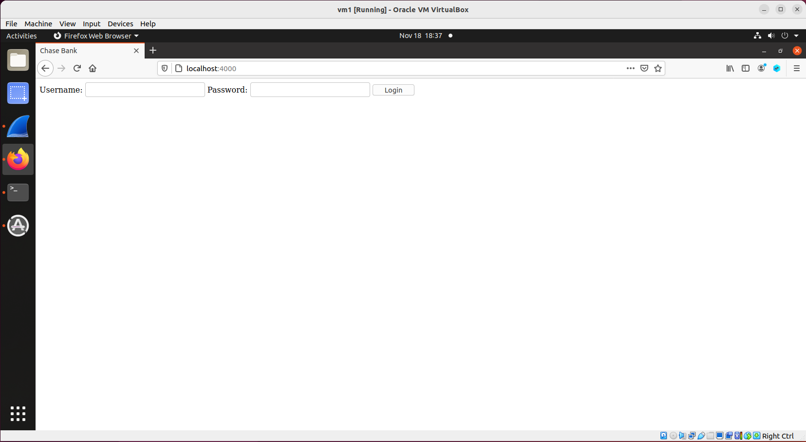
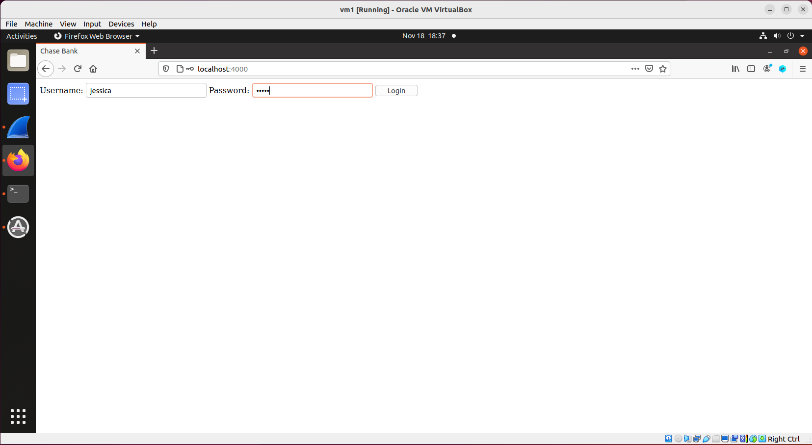
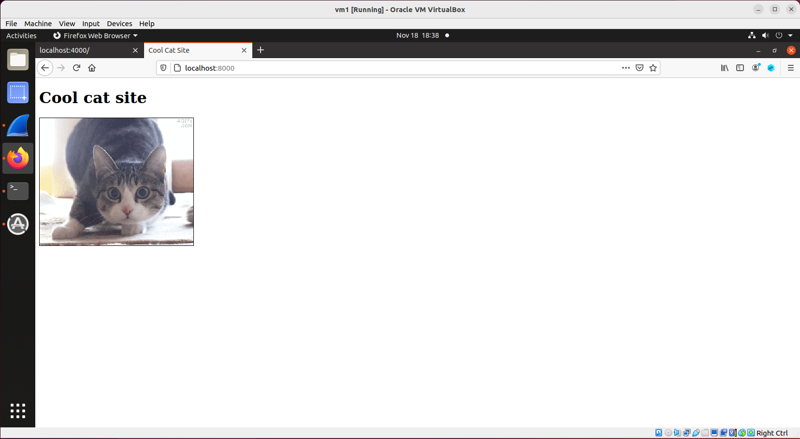
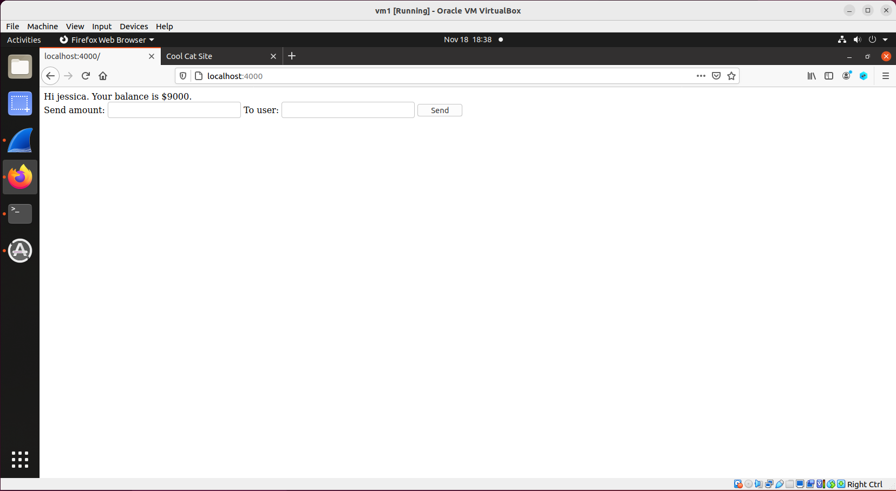

## Cross-site Request Forgery (CSRF Attack)

### Requirements 

In this lab, the victim is openning two tabs in the browser, one is an online banking website, another is the attacker's website. The victim is signed into the online banking website. The attacker will perform a CSRF attack against the victim. If the attack is successful, when the victim refreshes the attacker's web page, the victim's money (in the bank account) will disappear.

### Setup

Only one VM is sufficient.

### Steps

1. install node:

```console
$ sudo apt install nodejs
$ sudo apt install npm
$ npm config set strict-ssl false
$ npm install express
$ npm install cookie-parser
$ npm install body-parser
```

2. set up the banking directoy:

```console
$ mkdir banking
$ cd banking/
$ wget http://ns.cs.rpi.edu/labs/csrf/banking/index.html
$ wget http://ns.cs.rpi.edu/labs/csrf/banking/server.js
```

- start the banking webserver:
```console
$ node server.js
```

3. access the website from the browser: type localhost:4000, you should see this:



4. login as jessica, username: jessica, password: 50505. You should see that Jessica's account balance at this moment is $10,000:




5. set up the attacker directory:

```console
$ mkdir attacker
$ cd attacker/
$ wget http://ns.cs.rpi.edu/labs/csrf/attacker/index.html
$ wget http://ns.cs.rpi.edu/labs/csrf/attacker/cat.gif
$ wget http://ns.cs.rpi.edu/labs/csrf/attacker/attacker-frame.html
```

- start the attacker web server:
```console
$ python3 -m http.server 8000
```

6. access the website from the browser: open a new tab (make sure the banking site tab is still open), type localhost:8000 and enter, you should see this:



7. refresh the banking page, if the attack is successful, jessica's account balance should have less money now.



As can be seen from the above screenshot, the attack is successful, and this concludes the lab.

### References:

CS253 Web Security – course created and taught by Feross Aboukhadijeh at Stanford University.
