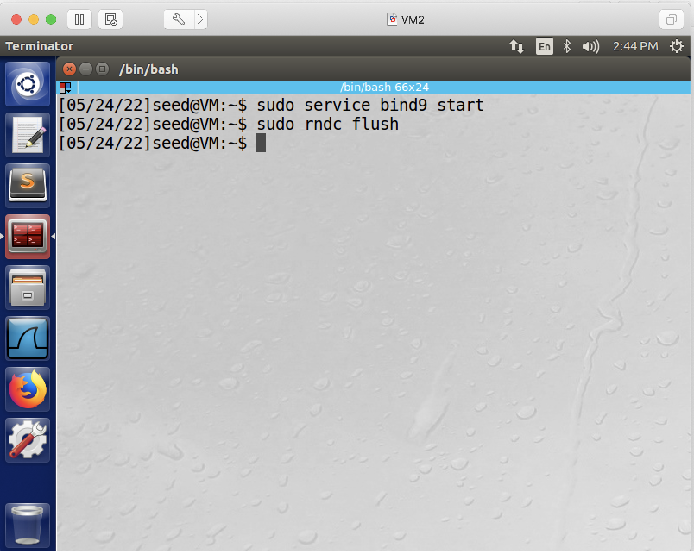
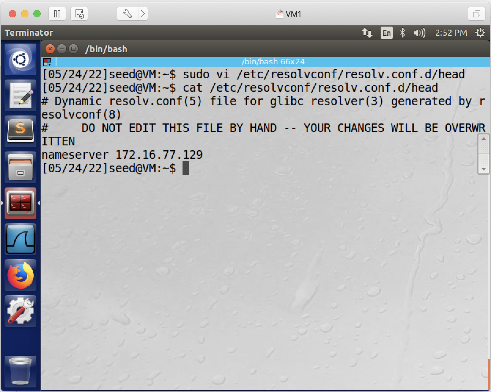
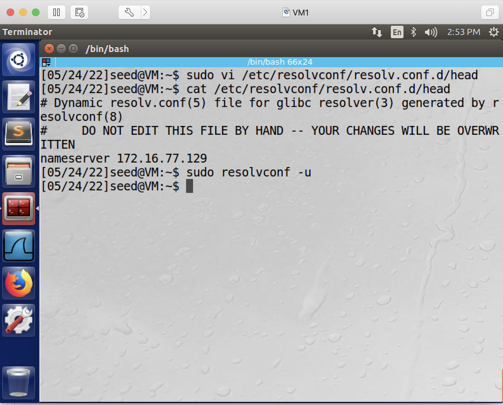
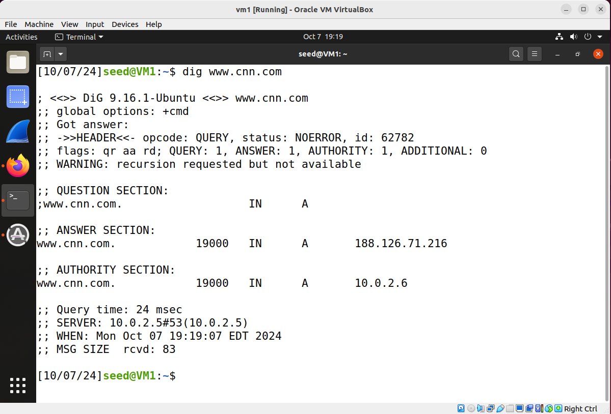
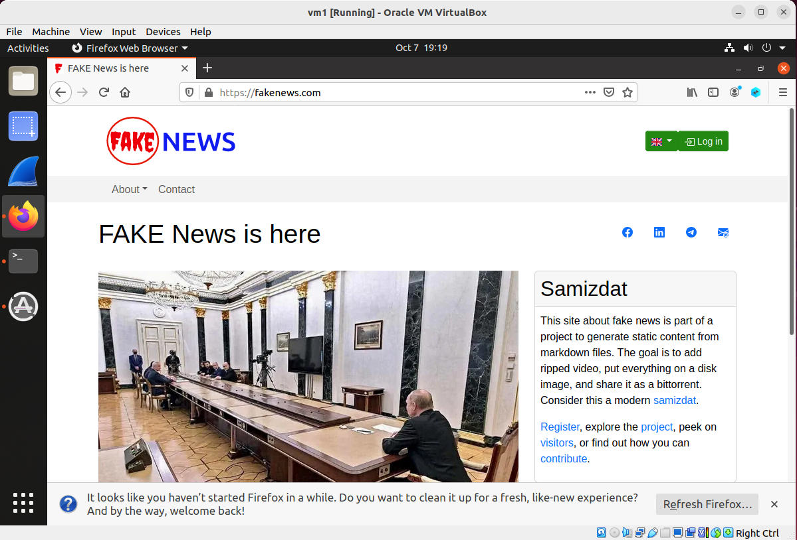

## Local DNS Attack

### Requirement

In this lab, you will send forged DNS responses to a victim client such that the client who visits www.cnn.com will now go to fakenews.com.

### Setup

3 Linux VMs: Victim (DNS) Client, Victim (DNS) Server, Attacker. All 3 VMs are located in the same network.

The following is the IP addresses for the VMs used in this README.

| VM  |  IP Address   |        Role         |
|-----|---------------|---------------------|
| VM1 | 10.0.2.4      | victim (dns) client |
| VM2 | 10.0.2.5      | victim (dns) server |
| VM3 | 10.0.2.6      |   attacker          |

### Preparation

1. on DNS Server machine: run theses commands to install the DNS server software - we will use BIND software. (BIND: Berkeley Internet Name Domain) 

```console
$ sudo apt update
$ sudo apt install bind9
```

these screenshots shows the commands to start the server.

2. on DNS Server machine: run this command to start the DNS service: 

```console
$ sudo service bind9 start (If it's already running, then # sudo service bind9 restart)
```

this screenshot shows the commands to start the server.



3. on victim client, configure DNS server information, 

3.1. run this following command, which adds a line to the end of file /etc/resolvconf/resolv.conf.d/head. The added line will tell the client the IP address of the DNS server, in this README, it is 10.0.2.5, and as you run the command you should change 10.0.2.5 to the IP address of your DNS server.

```console
$ echo "nameserver 10.0.2.5" | sudo tee -a /etc/resolvconf/resolv.conf.d/head > /dev/null
```

3.2 after running the above command, we can use *cat* to confirm that line is added to the file /etc/resolvconf/resolv.conf.d/head:

```console
$ cat /etc/resolvconf/resolv.conf.d/head
```

this screenshot shows the file is now edited:


3.3. run the following command so the above change in that file will take effect:

```console
$ sudo resolvconf -u
```



### Attack

1. on attacker VM, run this [dns_attack.py](dns_attack.py) script. What this script does is, it sniffs all DNS packets coming from the victim client, and if client asks questions about the IP address of www.cnn.com, this script responds to the victim with a forged response which says that the IP address of www.cnn.com is 188.126.71.216, which is the IP address of fakenews.com.

**Note**: You need to change this one line in the script, specify the IP of address of victim client.

```console
DNS_CLIENT_IP = "10.0.2.4"
```

2. on victim client, send a DNS query.

```console
# dig www.cnn.com 
```

these two screenshots show the attack is successful: www.cnn.com is mapped to 188.126.71.216, which is the IP address of fakenews.com.



3. on victim client, open firefox, and enters www.cnn.com.

these two screenshots once again show that the attack is successful: the victim who attempts to visit www.cnn.com, and taken to the page of fakenews.com.


### Clean up

You are recommended to remove the line you added in the preparation steps, in this file: /etc/resolvconf/resolv.conf.d/head, so that your future experiments won't be affected.
