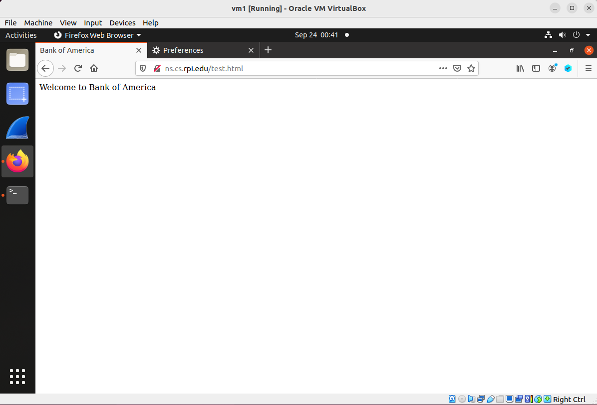

## Man-in-the-Middle (MITM) Attack 

### Requirement

This lab will demonstate what a coffee shop employee can do. Assume a coffee shop employee has physical access to the store's wifi router. In this lab, you will be acting like this employee. Since store customers will be connecting to this wifi router, this wifi router naturally will serve as the gateway machine, and as the gateway machine it naturally can be used to perform man-in-the-middle attack.

In this lab, the attacker will intercept a victim's HTTP traffic and modify the content of a web page presented to the victim client.

### A Provided Web Server

A web server is provided for this lab, and one specific web page will used for this lab, which is hosted on [http://ns.cs.rpi.edu/test.html](http://ns.cs.rpi.edu/test.html).

You do not need to set up your own web server.

### Setup

2 Linux VMs. VM1 as the victim (web client); VM3 as the attacker. The 2 VMs reside in the same network. The following is the IP addresses for the VMs used in this README.

| VM  |  IP Address  |
|-----|--------------|
| VM1 |  10.0.2.4    |
| VM3 |  10.0.2.6    |

Also, on the attacker's machine, changing the firewall setting:

```console
$ sudo iptables -F
$ sudo iptables -A INPUT -p tcp --sport 80 -j DROP
$ sudo iptables -A FORWARD -p tcp --sport 80 -j DROP
$ sudo iptables -A OUTPUT -p tcp --dport 80 -j DROP
```

These firewall settings tell the kernel to leave HTTP packets alone, and do not react to them, because the attacker will run a script to react to these packets.

### Attack: 

1. The victim, opens firefox, accesses the web page: [http://ns.cs.rpi.edu/test.html](http://ns.cs.rpi.edu/test.html). As of now, it shows:



2. The victim, specifies the attacker's machine as the gateway - so as to simulate the situation when the victim is connected to a public wifi where the owner can be a malicious actor.

```console
$ sudo ip route add default via 10.0.2.6 // here, change 10.0.2.6 to your attacker's IP
```

This screenshot shows the moment right before executing this command, 


This screenshot shows the moment right after executing this command, 


This screenshot shows the effect of this command as shown in the routing table - a default gateway is added.


3. The attacker, runs the attack script: [http\_attack.py](http_attack.py). You need sudo to run the script:

```console
$ sudo python3 http_attack.py
```

Note: You have to change the IP addresses and the network interface in the above script, so as to reflect the correct information in your environment. In total you need to change 3 lines:

```console
CLIENT_IP = '10.0.2.4'   # The IP of your client
ATTACKER_IP = '10.0.2.6'  # The IP of the attacker
IFACE = "enp0s3"         # The Network interface to capture packets
```

This screenshot shows the moment right before the attacker launches the attack.


Explanation: what this script does is: keep sniffing packets going between the victim client and the web server, when a packet which goes from the client to the web server is captured, just forward it to the server, when a packet which goes from the web server to the client is captured, modify its content so as to show the message "this site is hacked".

4. the victim, refreshes the web page: [http://ns.cs.rpi.edu/test.html](http://ns.cs.rpi.edu/test.html). This screenshot shows that the web page is changed, which proves that the attack is successful and this concludes this lab.


**Troubleshooting tips**: if refreshing the web page does not change the content, remember to delete the browser cache, you can find the button (to delete the cache) in **Preferences** in firefox.
