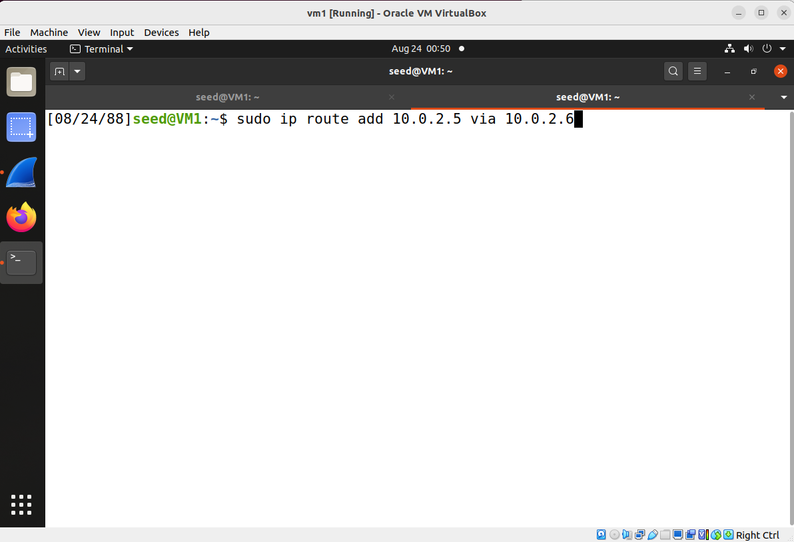
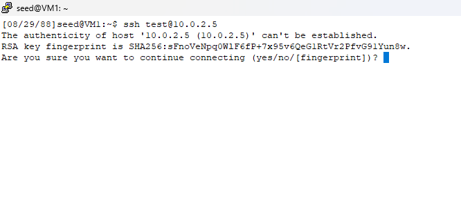
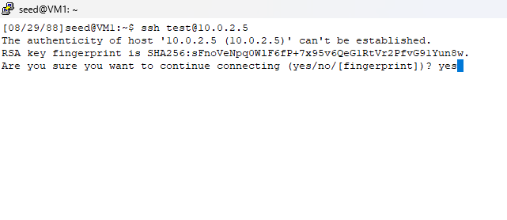

## Man-in-the-Middle (MITM) Attack Against SSH

### Requirement

This lab will once again demonstate what a coffee shop employee can do. Assume a coffee shop employee has physical access to the store's wifi router. In this lab, you will be acting like this employee. Since store customers will be connecting to this wifi router, this wifi router naturally will serve as the gateway machine, and as the gateway machine it naturally can be used to perform man-in-the-middle attack.

In this lab, the attacker will pose as the legitimate SSH server, and capture the user's SSH username and password, even though people have all told you that SSH uses encryption.

### Assumption

In this lab, we assume the victim is accessing this SSH server for the first time.

### Setup

- 3 Linux VMs. VM1 as the victim client (ssh client), VM2 as the victim server (victim server), VM3 as the attacker. Although these 3 VMs reside in the same network, the attack should work no matter the SSH server is located in this same network or not. The following is the IP addresses for the VMs used in this README.

| VM  |  IP Address  |
|-----|--------------|
| VM1 |  10.0.2.4    |
| VM2 |  10.0.2.5    |
| VM3 |  10.0.2.6    |

- On the victim server, create a temporary user called test:

```console
$ sudo useradd -m test
$ sudo passwd test
```

Set a password of your choice for this user test. In this README, the chosen password is "hackme", and at the end of the lab, the README will show a screenshot where the attacker sees the username "test" and the password "hackme".

- On the victim client, delete this file:

```console
rm -f ~/.ssh/known_hosts
```

**Explanation**: This file stores the ssh keys for hosts which the user has visited before, and if the ssh key changes, the ssh client will raise a warning. And in the situation of man-in-the-middle attacks, the attacker would send the attacker's ssh key to the victim client, and thus the ssh client would raise a warning. However, in this lab, we assume the victim is accessing this ssh server for the first time, meaning it is not a known host, and in such a scenario, the ssh client would not notice the ssh key changes - since the victim client has never seen the legitimate server's key before.

Also, on the attacker's machine, change the firewall setting:

```console
$ sudo iptables -F
$ sudo iptables -P FORWARD ACCEPT
$ sudo iptables -t nat -A PREROUTING -p tcp -d 10.0.2.5 --dport 22 -j DNAT --to-destination 10.0.2.6:9090 // you need to change the IP addresses here to match yours, do not change the port 9090. This firewall rule says that "please redirect all traffic destined to 10.0.2.5 at port 22 to 10.0.2.6 port 9090", in other words, for every packet whose destination goes to the legitimate SSH server, redirect the packet to the attacker's machine port 9090, and the attacker will run a script which listens to this port 9090.
```

You are recommended to read the [notes here](../../notes/firewall/iptables.md) to have a better understanding of this last iptables rule.

### Attack: 

1. The victim client, specifies the attacker's machine as the gateway - so as to simulate the situation when the victim is connected to a public wifi where the owner can be a malicious actor.

```console
$ sudo ip route add 10.0.2.5 via 10.0.2.6 // here, change 10.0.2.5 to your server's IP and change 10.0.2.6 to your attacker's IP
```

With this routing rule, all traffic destined to 10.0.2.5 would first go through 10.0.2.6.

This screenshot shows the moment right before executing this command, 



This screenshot shows the moment right after executing this command, 


This screenshot shows the effect of this command as shown in the routing table - a gateway is added for the destination 10.0.2.5.


2. The attacker, runs the attack script: [ssh\_attack.py](ssh_attack.py). You need sudo to run the script:

```console
$ sudo python3 ssh_attack.py
```

**Note**: You need to change this line in the script, specify the IP of address of the VM which runs the real SSH server.

```console
SERVER_IP = '10.0.2.5'
```

This screenshot shows the moment right before the attacker launches the attack.


This screenshot shows the moment right after the attacker launches the attack.


Explanation: what this script does is: starts a fake ssh server and waits for the victim client to connect; when the victim client connects and types credentials, the script then uses the received credentials to connect to the real ssh server, after that, the script just forwards packets between the victim client and the real ssh server.

3. The victim client, ssh to the server using the test account, type password to login:


Victim enters "yes" and types the password.



After typing the password, the victim will connect to the real SSH server and can then run SSH commands as normal.


As an example, the victim runs the command "ifconfig" to confirm that the IP address of this machine is indeed the IP address of the real SSH server.


4. The attacker, now should see the user's user name and password on the terminal which runs the attacking script, as shown in this screenshot:


This screenshot shows the attack is successful and this concludes this lab.

### Clean Up

There are still some clean up work for you to do so as to restore the VM to a clean state.

1. On the victim client, remove the newly added routing rule (so that it does not affect your future labs):

```console
$ sudo ip route detele 10.0.2.5 via 10.0.2.6 // here, change 10.0.2.5 to your server's IP and change 10.0.2.6 to your attacker's IP
```

2. On the attacker machine, remove the newly added firewall rules (so that they do not affect your future labs):

```console
$ sudo iptables -F
$ sudo iptables -t nat -F
```

### Limitation

There is one limitation here: This attack mainly targets situations when the victim connects to an SSH server for the first time. When it is not the first time, the victim client will get a warning message, produced by the SSH client program. And such a warning can raise a red flag and therefore a cautious user may decide not to use SSH at this moment.
