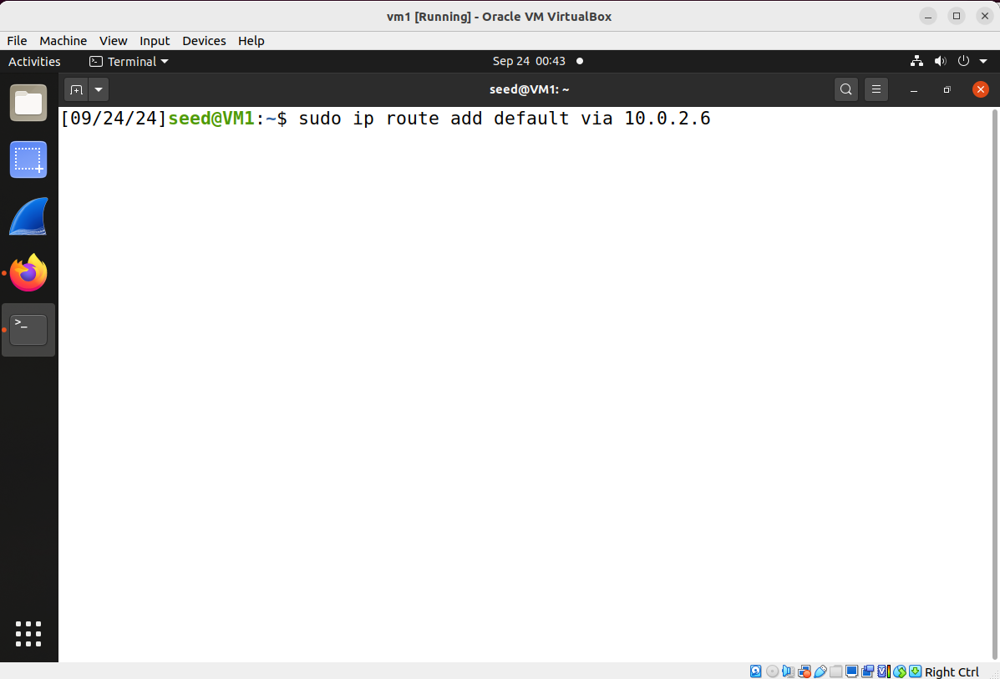
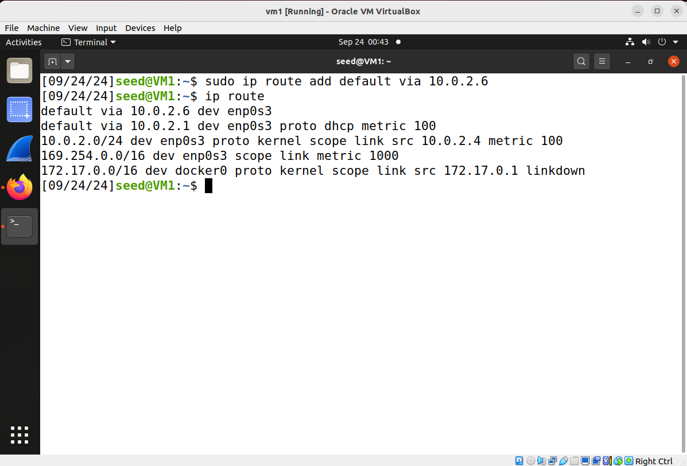
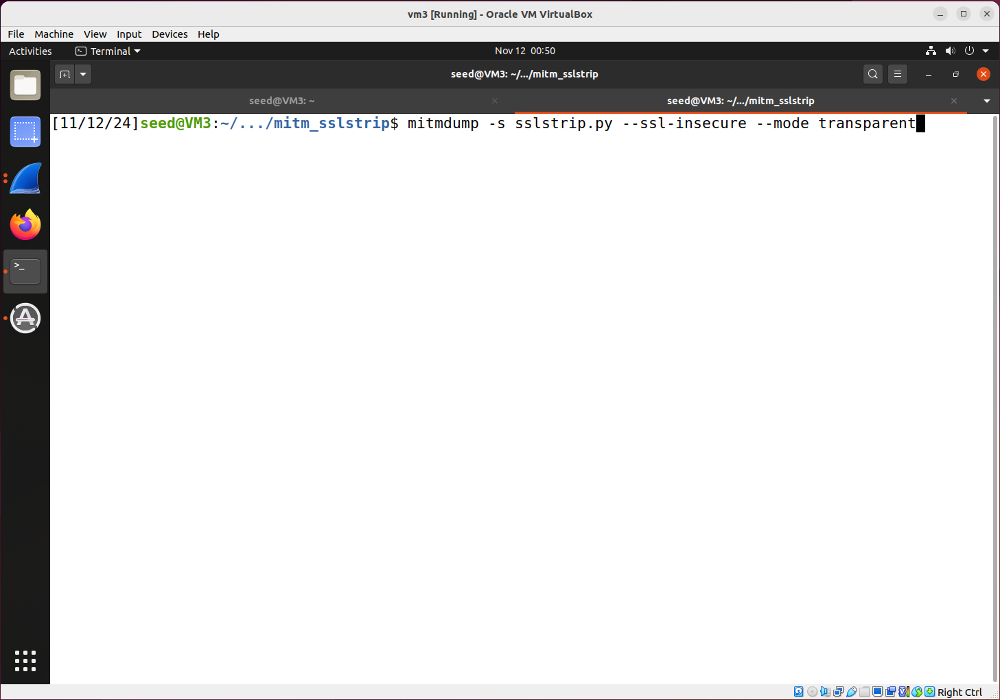
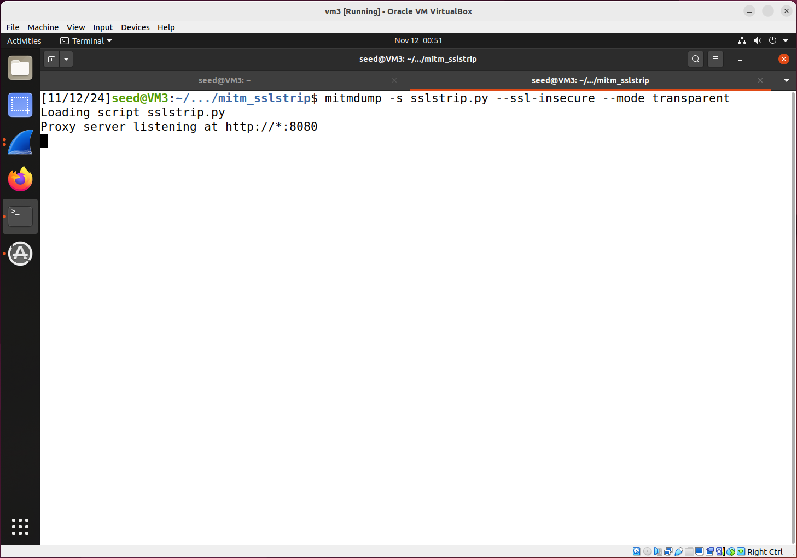
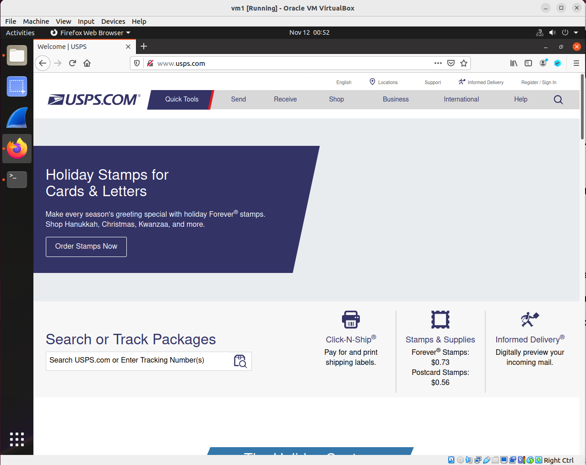
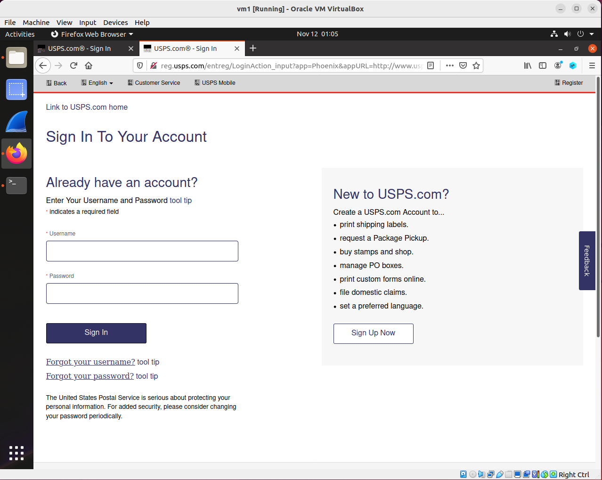
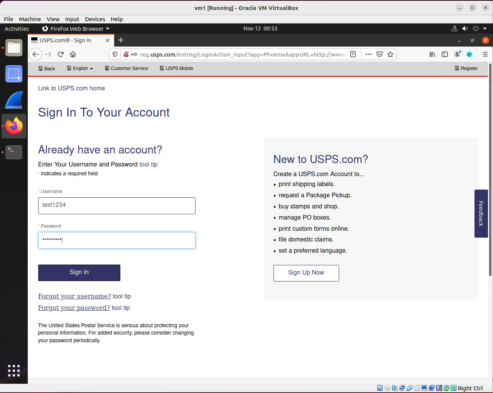
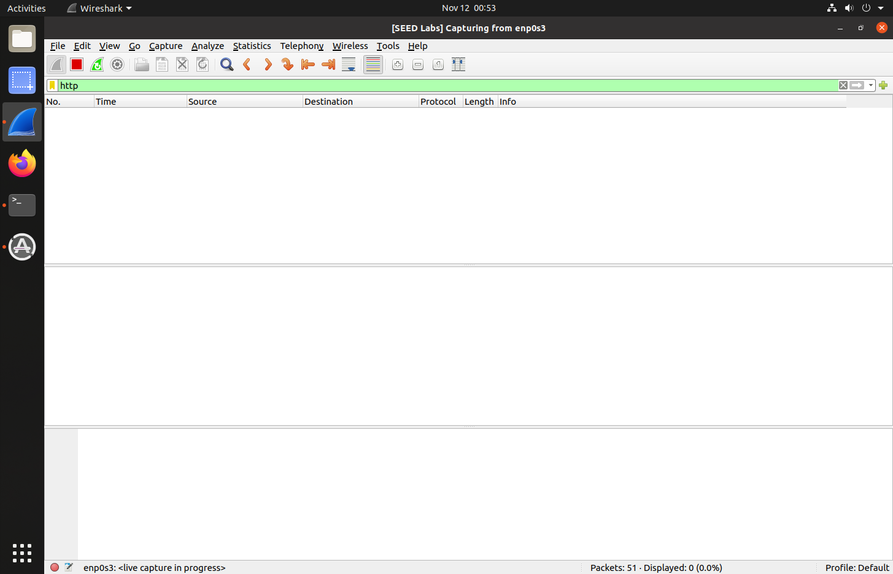
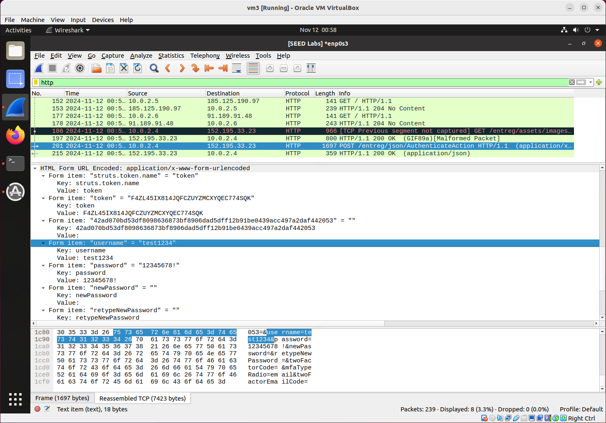
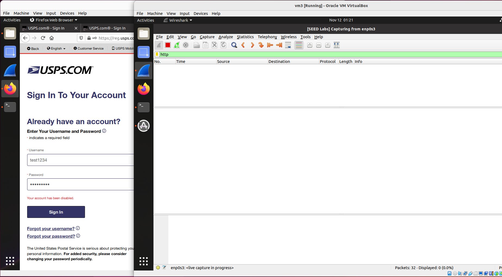

## Man-in-the-Middle (MITM) Attack Against HTTPS (a.k.a. the SSLstrip attack)

### Background

HTTPS is designed to protect against man-in-the-middle (MitM) attacks by encrypting data transmitted between a client (like a web browser) and a server, making it much more difficult for attackers to intercept or alter the communication. HTTPS, which uses the SSL/TLS protocol, encrypts data before it is sent over the internet. This means that even if an attacker manages to intercept the data, they would only see encrypted content, not readable information like usernames, passwords, or credit card numbers. This encryption is achieved through public and private keys, which are part of a secure key exchange process between the client and server.

Yet, HTTPS is still not a panacea. In this lab we will learn the SSLStrip attack, which is effective against HTTPS. SSLstrip is a type of cyberattack that exploits vulnerabilities in how HTTPS connections are managed to intercept and monitor data meant to be encrypted. Introduced by security researcher Moxie Marlinspike in 2009, SSLstrip specifically targets the transition between HTTP (unencrypted) and HTTPS (encrypted) communication, making it possible for an attacker to downgrade secure connections to unencrypted ones and thus capture sensitive data such as login credentials and personal information.

SSLstrip typically requires the attacker to be in a position to intercept network traffic. This is often achieved through a Man-in-the-Middle attack, where the attacker places themselves between the victim and the legitimate website or server. This can be done using techniques like ARP spoofing or DNS spoofing to redirect the victim’s traffic through the attacker’s machine. But in this lab, to simplify the lab steps, we will just demonstrate that when a victim connects to a coffee shop's wifi, what the coffee shop employee can do. We assume the coffee shop employee has physical access to the store's wireless router. In such a scenario, the wireless router naturally will serve as the gateway machine, and as the gateway machine it naturally can be used to perform man-in-the-middle attack, and SSLstrip works like this:

1. When a user types a website URL without specifying "https://" (e.g., typing example.com), most websites automatically redirect the user from http://example.com to https://example.com for a secure connection. More specifically, the web server responds with an HTTP 301 or 302 redirect response to upgrade the connection to HTTPS (i.e., redirecting from http://example.com to https://example.com)
2. The attacker intercepts and modifies this redirect response, stripping out the upgrade to HTTPS and keeping the connection on HTTP. This way, the client never actually connects to the secure HTTPS version and remains on HTTP. As an example, the following is the python code segment, which simply replaces the string "https" in the HTTP response to the string "http".
```python
   # Ensure that the response is in HTTP format to send back to the client
    if flow.response.status_code == 301 or flow.response.status_code == 302:
        location = flow.response.headers.get("Location")
        if location and location.startswith("https://"):
            # Change "https" to "http" in the redirect location
            flow.response.headers["Location"] = location.replace("https://", "http://", 1)
```
3. Meanwhile, the attacker establishes a secure HTTPS connection with the server on behalf of the client. They keep the connection between the server and attacker encrypted. However, the attacker continues to communicate with the client over HTTP, exposing sensitive information like login credentials in plaintext and allowing the attacker to view and modify the data.
4. As a result, while the attacker connects securely to https://example.com, they relay the page back to the victim over HTTP (unencrypted), thus "stripping" away HTTPS.

**Question**: Will step 2 here lead to an infinite loop? Client visits http://example.com, server forces client to go to https://example.com, attacker changes it to http://example.com, and thus client will go to http://example.com, server forces client to go to https://example.com, attacker once again changes it to http://example.com...this will never come to an end and eventually the browser will display a timeout message. How is this addressed in the script we use for this lab?

### Lab Requirement

In this lab, the attacker will use the SSLstrip technique to intercept a victim's HTTP traffic and capture the victim client's login credentials to the site: [www.usps.com](www.usps.com).

**Note**: This website is chosen for this lab mostly because of its relatively simple web interface. Many other popular websites use fancy technologies and do not support the browser our virtual machines use.

### Setup

2 Linux VMs. VM1 as the victim (web client); VM3 as the attacker. The 2 VMs reside in the same network. The following is the IP addresses for the VMs used in this README.

| VM  |  IP Address  |
|-----|--------------|
| VM1 |  10.0.2.4    |
| VM3 |  10.0.2.6    |

#### Victim VM setup

On the victim VM, we specify the attacker's machine as the default gateway - so as to simulate the situation when the victim is connected to a public wifi where the owner can be a malicious actor.

```console
$ sudo ip route add default via 10.0.2.6 // here, change 10.0.2.6 to your attacker's IP
```

This screenshot shows the moment right before executing this command, 



This screenshot shows the moment right after executing this command, 


This screenshot shows the effect of this command as shown in the routing table - a default gateway is added.



#### Attacker VM setup

On the attacker's machine, change the firewall setting and enable ip forwarding:

```console
$ sudo iptables -F
$ sudo iptables -P FORWARD ACCEPT
$ sudo sysctl -w net.ipv4.ip_forward=1
$ sudo iptables -t nat -F
$ sudo iptables -t nat -A PREROUTING -p tcp --destination-port 80 -j REDIRECT --to-port 8080
```

The 5th command here redirects the victim's HTTP traffic to the attacker's port 8080, and we will run a script on the attacker's VM which listens on port 8080, and intercepts the victim's HTTP traffic.

Also, install the library which will be used by the attacking script.

```console
$ sudo apt install mitmproxy
$ sudo pip3 install blinker==1.4
$ sudo apt remove python3-bcrypt
$ pip3 uninstall bcrypt		// no sudo here; after this and the above command, the command *pip3 list | grep bcrypt* should show nothing.
$ sudo pip3 install bcrypt==3.1.7
```

### Attack: 

1. The attacker, runs the attack script: [sslstrip.py](sslstrip.py).

<!-- $ mitmdump -s sslstrip.py -->
```console
$ mitmdump -s sslstrip.py --ssl-insecure --mode transparent
```

These screenshots show the moment right before and right after the attacker launches the attack.



2. The victim, opens firefox and types [www.usps.com](http://www.usps.com), 



and clicks on the "Register/Sign in" button on the top right corner of the page, which will take the victim to this next page:



3. The victim now enters a username, here, for example, is test1234, and a password, in this README, we will be using 12345678!, but you can type whatever you want to; but DO NOT press the "Sign in" button yet!



4. The attacker opens wireshark, starts monitoring, and enters *http* in the filter bar, since we will only be monitoring http packets.



5. Now the victim presses the "Sign in" button.

6. The attacker should now see an HTTP POST request in wireshark, and let's find the victim's username and password here. Here, the HTTP POST request is packet 201, when packet 201 is selected, we scroll down in the second window of wireshark, and we can see the user's username and password, as shown in this screenshot:



This shows the attack is successful.

### Defense:

What we learned here is that, even if most major websites use HTTPS nowadays, as the user, you can't just type www.usps.com in your address bar (of the browser), you really have to type the full url, i.e., https://www.usps.com. Let's try that here:

7. The victim opens another browser tab, types [https://www.usps.com](https://www.usps.com), and clicks on the "Register/Sign in" button on the top right corner of the page, now in the sign in page, enters the username and password while the attacker keeps monitoring in wireshark. Can the attacker still see the POST request? Not any more, as shown in this next screenshot:


