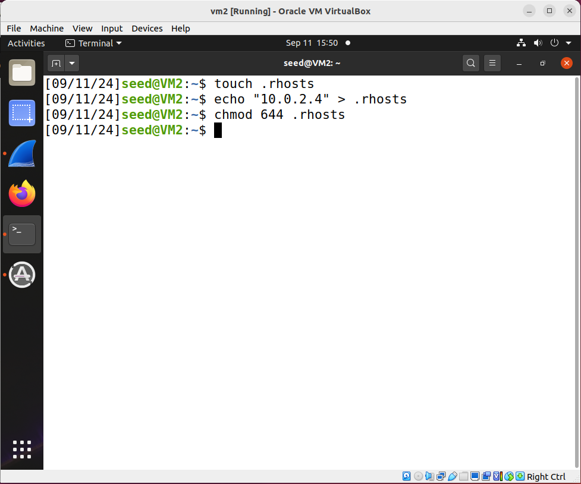
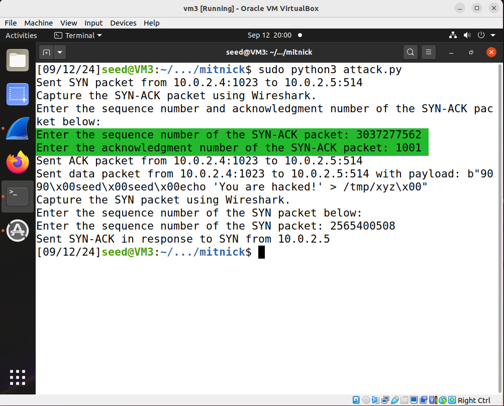
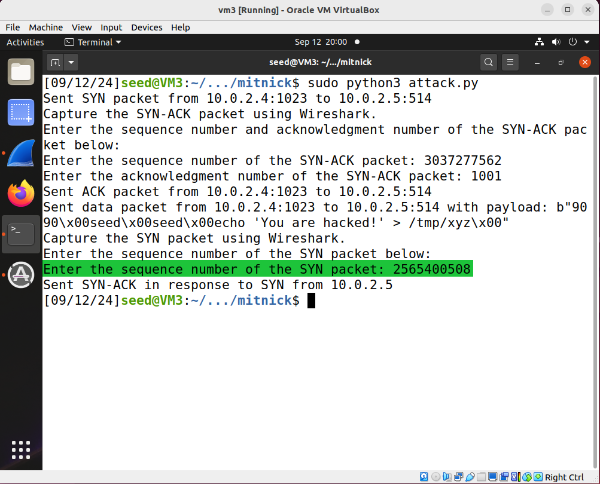

## The Kevin Mitnick Attack 

**Note**: make sure you understand TCP 3-way handshake before you start this lab. The Kevin Mitnick attack is mainly about exploiting the TCP 3-way handshake process. See this [animation](https://jidongxiao.github.io/networksecurity/animations/tcp_3way_handshake/index.html) to know the basics about the TCP 3-way handshake.

### Requirements

In this lab, we will demonstrate the Kevin Mitnick attack - a special case of the TCP session hijack attack. Instead of hijacking an existing TCP connection between victims A and B, the Mitnick attack creates a TCP connection between A and B first on their behalf, and then naturally hijacks the connection. Specifically, Kevin Mitnick created and hijacked rsh connections. In this lab, the attacker's goal is to create a file **/tmp/xyz** on the victim server machine, and the content of this file will be "You are hacked!".

### Setup

3 Linux VMs. VM1 as the victim client; VM2 as the victim rsh server; VM3 as the attacker. The 3 VMs reside in the same network. This README uses the following IP addresses.

| VM Name | Role                 | IP Address |
|---------|----------------------|------------|
| VM1     | victim client        | 10.0.2.4   |
| VM2     | victim rsh server    | 10.0.2.5   |
| VM3     | attacker             | 10.0.2.6   |


**Note:** in the original Kevin Mitnick attack, the attacker's machine was not in the same network. Back then TCP sequence numbers were easily predictable, today it is not. To simulate the attack and simplify our task, we assume we still know the sequence numbers - we will, in the lab, obtain the sequence numbers from wireshark. 

**Background knowledge**: In rsh, two TCP connections are needed. One for normal communication, the other for sending error messages. In the first connection, the client port must be 1023, and the server port must be 514. In the second connection, the server port must be 1023, but the client port can be anything - in this lab, we will choose 9090. The attacker can inject rsh commands once the first TCP connection is established, but based on the rsh protocol, the commands will only be executed once the second TCP connection is established.

In this lab, a python script named [attack.py](attack.py) is provided for establishing these two TCP connections and send the rsh command. But the script will need your input in two situations, where you need to identify the sequence number and acknowledgment number of some packets using wireshark and give these numbers to the script.

### Preparation steps: 

step 1. installing rsh on client, server, and the attacker's machine. Run the following two commands on all 3 VMs:

```console
$ sudo apt-get update
$ sudo apt-get install rsh-redone-client
$ sudo apt-get install rsh-redone-server
```

step 2. configure rsh on the victim server machine.

```console
$ touch .rhosts
$ echo [victim client’s IP address] > .rhosts (replace "victim client's IP address" with the actual IP address)
$ chmod 644 .rhosts
```

These commands look like this:


If the above configuration is correct, you should be able to run the follow command on the victim client machine, and it will show you the current date information.

```console
# rsh [victim server’s IP] date
```

Like this:


As a comparison, if you run the same command from the attacker's machine, you will get an error like this:


step 3. simulating the syn flooding attack.

3.1: on the victim server, run:

```console
# sudo arp -s [victim client’s IP] [victim client’s MAC]
```

This step is needed so that the server remembers the MAC address of the client, which is needed for the server to send packets to the client.

This screenshot shows how to find the victim client's MAC address:


This screenshot shows the above arp command:


3.2: shutdown the victim client VM - we do so to simulate the situation when the client is under serious syn flooding attack and can't respond. **Explanation**: why do we want the server to remember the MAC address of the client? Because computers in the same network use MAC addresses, instead of IP addresses, to communicate. And once we shutdown the victim client, if the server doesn't know the victim client's MAC address, the server simply won't send any packet to the client; but our attack won't be successful if the server doesn't send any packet to the client.

This screenshot shows the command to shutdown the victim client VM:


<!-- step 4. in the attacking steps (next section), right after step 6.1, we need to run step 6.2 as soon as possible, otherwise the server will RESET the 1st TCP connection; similarly, right after step 6.3, we need to run step 7.1 as soon as possible, otherwise the server will RESET the 2nd TCP connection. Therefore, writing a sniffing-and-spoofing script would be the better way to perform this attack.

Alternatively, we can run these two commands on the server so that it does not RESET that fast.

```console
# sudo sysctl -w net.ipv4.tcp_syn_retries=50
# sudo sysctl -w net.ipv4.tcp_synack_retries=50
```

This screenshot shows these two commands:


**Explanation**: these two commands are saying, do not reset the tcp connection, unless one party of the connection has tried *syn* more than 50 times; do not reset the tcp connection, unless one party of the connection has tried *syn-ack* more than 50 times.
-->

step 4. Sanity check - make sure there is no such a file called **/tmp/xyz** on the server machine - as our ultimate goal in this lab is to create such a file.

This screenshot shows, at this moment, there is no such a file called **/tmp/xyz** on the **server** machine.


### Attacking steps:

An attacking script is provided, and it is [attack.py](attack.py). Please change the IP addresses in this script to match your setup. More specifically, you will change these two lines (and only these two lines) in the script:

```console
source_ip = "10.0.2.4"  # Spoofed IP
destination_ip = "10.0.2.5"
```

The source\_ip must be the victim client's IP address, and the destinaion\_ip must be the victim server's IP address. Once again, do not change any other lines of the script.

step 5. Turn on wireshark and start capturing.

step 6. Run the script. 

This screenshot shows how to run the script:


This screenshot shows the moment right after pressing enter (to run the script):


The script will first use the victim's IP address (as the source IP address) to send a spoofed SYN packet to the victim server, and thus create the first TCP connection. 

step 6.1. After the SYN packet is sent, the victim server would respond with a SYN-ACK packet, and we now need to go to wireshark and find the sequence number and acknowledgment number of this SYN-ACK packet. The script is now asking us to enter these two numbers.

This screenshot shows we find the sequence number and the acknowledgment number of this SYN-ACK packet:


This screenshot shows we enter the sequence number and the acknowledgment number of this SYN-ACK packet:


step 6.2. Right after we enter the two numbers, the script will now send a TCP ACK packet to the victim server and thus establish the first TCP connection. After the first TCP connection is established, the script will send a TCP Data packet with a payload which contains a command to create a file named **/tmp/xyz** on the server machine. However, based on the rsh protocol, such command would not run until a second TCP connection is established. And this second TCP connection will be initiated by the victim server, meaning that the victim server would send a TCP SYN packet to the victim client, now we need to go to wireshark and find the sequence number of this SYN packet and enter it as the script asks.

This screenshot shows we find the sequence number of this SYN packet:


This screenshot shows we enter the sequence number of this SYN packet:


after entering the sequence number of this SYN packet, the script would send a spoofed SYN-ACK packet to the victim server, and the victim server would respond with an ACK packet to complete establishing this second TCP connection, and once this second TCP connection is established, the injected command should run and the attack is complete.

### Verification steps:

step 7. now that the attack is complete, we just need to verify that it is successful. To do so, on the victim's server machine, we check to see if **/tmp/xyz** is created. And as the screenshot shows, it is successful.


The above screenshot shows the file **/tmp/xyz** is now existing - this indicates that the attack is successful, and this concludes the lab.
