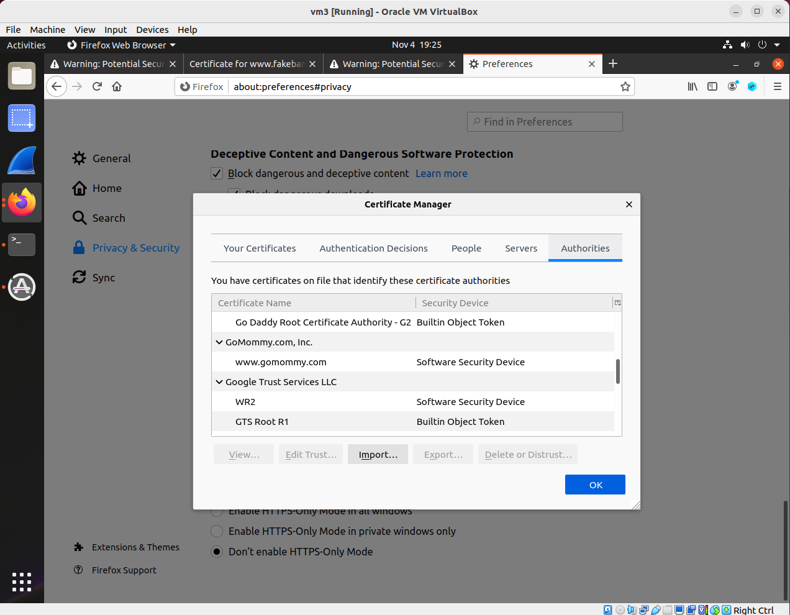

## Man-in-the-middle attack against PKI

### Requirements 

In this lab, you will first see how PKI defeats man-in-the-middle attack, but then if the CA is compromised - its private key is exposed, then attackers launching a man-in-the-middle attack can defeat PKI. The attacker's goal is, when the victim visits https://www.bankofamerica.com, the victim will actually be taken to https://www.fakebank.com (a website created by the attacker).

### Setup

Two VMs: victim VM and attacker VM.

The following is the IP addresses for the VMs used in this README.

| VM  |  IP Address   |      Role        |
|-----|---------------|------------------|
| VM1 | 10.0.2.4      |   victim VM      |
| VM3 | 10.0.2.6      |   attacker VM    |


### Assumptions

We assume there is a trusted CA called GoMommy. And GoMommy's private key and certificate are both created already (named ca.key and ca.crt). We also assume we have used this CA to certify a website called www.fakebank.com. The private key and certificate for this website are also created and provided (named fakebank.key and fakebank.crt).

### Steps

0. On both the victim VM and the attacker VM: Download GoMommy's certificate ca.crt (from here: http://ns.cs.rpi.edu/pki/ca.crt), and then load it into the firefox browser:

Preferences -> Privacy & Security -> Certificates -> View Certificates -> Import.

**Note**: select "Trust this CA to identify websites."




<!--(if you don't see Import, use the view-\>zoom out option of your browser)-->

**Note 2**: we import this because we assume GoMommy is a trusted CA, and for trusted CA, its certificate is supposed to be pre-loaded in the browser.

#### Attacker Setting Up www.fakebank.com

1.1. download fakebank.key and fakebank.crt into the home directory - i.e., /home/seed/ directory. (download fakebank.key from http://ns.cs.rpi.edu/pki/fakebank.key, and download fakebank.crt from http://ns.cs.rpi.edu/pki/fakebank.crt)

1.2. setup a website called www.fakebank.com on the attacker's VM. first, we create a folder under /var/www, called *fakebank*.

```console
$ sudo mkdir /var/www/fakebank
```

1.3. we then create the home page for fakebank.com. Inside /var/www/fakebank, we create a file called index.html, with the following content:

```console
$ sudo vi index.html
<html>
<body>
	Welcome to Bank of America! What would you like the power to do?
</body>
</html>
```

1.4. we then setup a virtual host so that we host www.fakebank.com via https. To achieve this, we add the following content at the end of this file: /etc/apache2/sites-available/000-default.conf.

```console
<VirtualHost *:443>
ServerName www.fakebank.com
DocumentRoot /var/www/fakebank
DirectoryIndex index.html

SSLEngine On
SSLCertificateFile /home/seed/fakebank.crt
SSLCertificateKeyFile /home/seed/fakebank.key
</VirtualHost>
```

**Note**: make sure the two files fakebank.crt and fakebank.key are indeed in the /home/seed/ directory.

1.5. run the following commands to configure and enable SSL.

```console
$ sudo a2enmod ssl	// this command enables ssl, a2enmod means "apache2 enable module", the opposite is a2dismod, which means "apache2 disable module".
$ sudo a2ensite default-ssl	// this command a2ensite enables an apache site, i.e., a virtual host, which is specified in the above 000-default.conf file. The opposite command is called a2dissite.
$ sudo apachectl configtest	// this command apachectl checks apache configuration file for valid syntax.
$ sudo service apache2 restart // this command actually starts the apache web server.
```

Note the passphrase here is 1234.

At this moment, if you, still on the attacker's VM, add "127.0.0.1 www.fakebank.com" in /etc/hosts, and you type https://www.fakebank.com in the browser, you should be able to access the www.fakebank.com we just created.

**Warning**: if you don't see the "Welcome to Bank of America!" page, then your attacking website setup is not successful, don't need to move forward.

#### Victim Visiting Bank of America

2.1. on the victim VM, we emulate the result of a DNS cache poisoning attack. So that www.bankofamerica.com points to the attacker's VM. We achieve this by editing /etc/hosts so as to have the following entry:

```console
ATTACKER_IP	www.bankofamerica.com
```

Replace ATTACKER_IP with the attacker VM's IP address.

2.2. we now type https://www.bankofamerica.com in the browser and see if the man-in-the-middle attack is successful - if so, we should be visiting the attacker's www.fakebank.com.

**Note**: the attack here will not be successful, and you, as the victim client, are expected get a warning message saying "Your connection is not secure", as shown below:


#### Attacker Stole the CA's Privacy Key

3.1. on the attacker VM, now we assume the attacker has compromised the CA and stole the CA's (i.e., GoMommy) private key ca.key. With this key, we, as an attacker, can sign any certificates in the name of GoMommy. Assume we, as the attacker, have created a private key for www.bankofamerica.com, and have signed a certificate for www.bankofamerica.com. The private key (named boa.key) and the certificate (named boa.crt) are here: http://ns.cs.rpi.edu/pki/boa.key and http://ns.cs.rpi.edu/pki/boa.crt. The attacker downloads these two files to its home directory, i.e., /home/seed.

3.2. Now edit the file we mentioned in Step 1.4, but change the ServerName to www.bankofamerica.com, and change the certificate and the key from fakebank to boa. i.e.:

```console
<VirtualHost *:443>
ServerName www.bankofamerica.com
DocumentRoot /var/www/fakebank
DirectoryIndex index.html

SSLEngine On
SSLCertificateFile /home/seed/boa.crt
SSLCertificateKeyFile /home/seed/boa.key
</VirtualHost>
```

3.3. Run the following command to restart the apache web server:

```console
# sudo service apache2 restart
```

Note: once again the passphrase here is 1234.

#### Victim Visiting Bank of America Again

4. On the victim VM, repeat step 2.1. Now the attack should be successful: the victim who types https://www.bankofamerica.com should be redirected to the attacker's https://www.fakebank.com, even though the browser still shows it is https://www.bankofamerica.com. As can be seen in the picture below.


