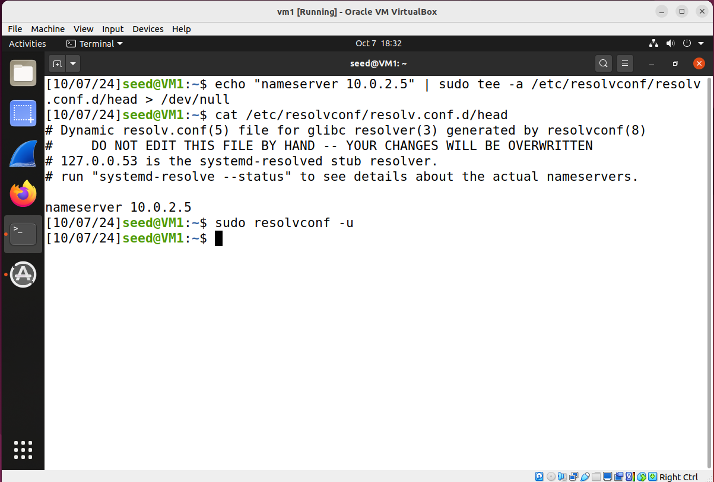
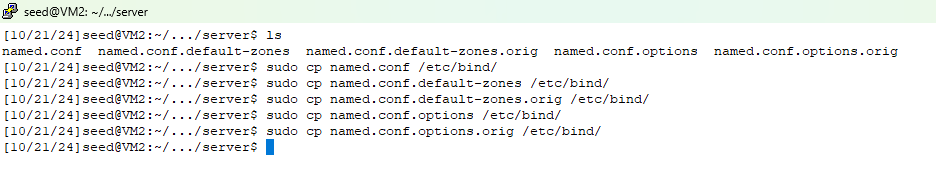
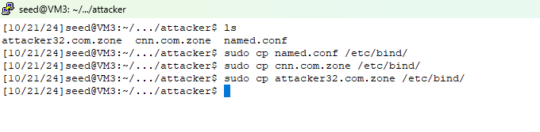
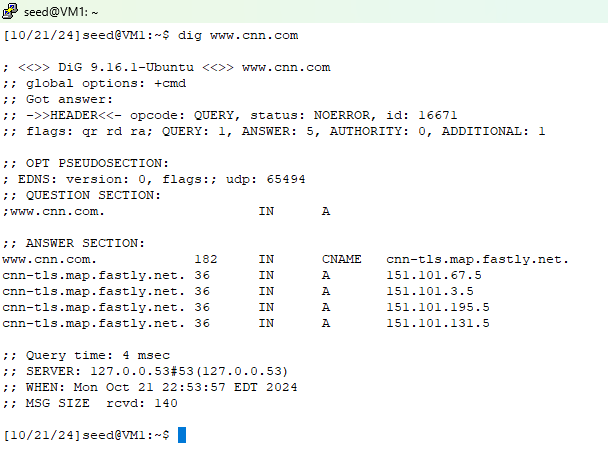
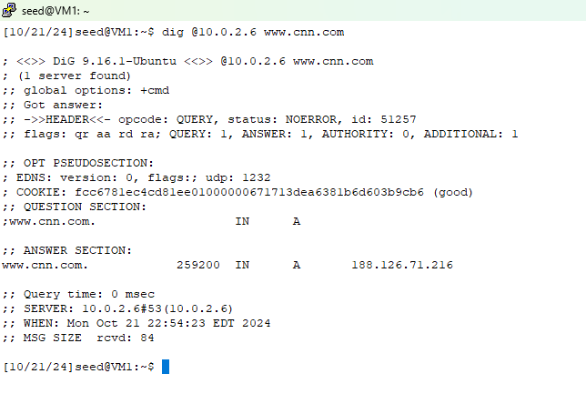
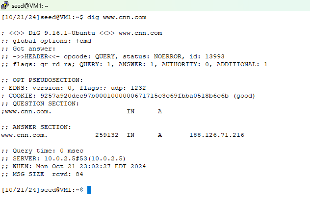

## Remote DNS Cache Poisoning Attack (aka, the Dan Kaminsky Attack)

**Note**: If you completed [Lab 11 Subdomain Takeover](https://github.com/jidongxiao/networksecurity/tree/main/labs/subdomain), you need to do the following clean up work on VM2 before start this lab.

1.  delete /etc/bind/db.cnn.com

2. remove these lines from /etc/bind/named.conf.local:

```console
zone "cnn.com" {
    type master;
    file "/etc/bind/db.cnn.com";
};
```

### Requirement

In this lab, you will poison the cache of a remote DNS server, and thus affect clients who rely on this DNS server. More specifically, we want clients who access www.cnn.com go to fakenews.com.

### Reference

You are recommended to watch this video first so as to understand how this attack works.

[The Kaminsky Vulnerability: DNS Under Attack](https://www.youtube.com/watch?v=qftKfFVHVuY)

### Setup

3 Linux VMs: victim (DNS) client, victim (DNS) server, attacker. All 3 VMs are located in the same network - however, we are not allowed to exploit this fact for the attacks, in other words, the attacker in this lab is not allowed to use wireshark or programs to sniff any packets. After all, this lab is trying to demonstrate how attackers from a remote network can still perform DNS cache poisoning.

The following is the IP addresses for the VMs used in this README.

| VM  |  IP Address   |              Role                     |
|-----|---------------|---------------------------------------|
| VM1 | 10.0.2.4      |   victim DNS client                   |
| VM2 | 10.0.2.5      |   victim DNS server                   |
| VM3 | 10.0.2.6      |   attacker, attacker's DNS server     |

### Steps

#### Client Configuration

1. on victim DNS client, configure DNS server information, i.e., let the client know the IP address of the victim DNS server.

1.1. add this line to the end of file /etc/resolvconf/resolv.conf.d/head (remember to replace DNS_SERVER_IP with your victim DNS server's IP address, plus, you need "sudo" if you edit the file using vi/vim.)

```console
nameserver DNS_SERVER_IP
```

*Note*: you did this same step in previous 2 steps.

1.2. run the following command so the above change will take effect:

```console
$ sudo resolvconf -u
```



#### Victim Server Configuration

2. setting up the victim DNS server.

2.1. copy the 5 files in [this folder](server) to the /etc/bind/ directory on VM2. Out of these 5 files, you need to change 1 of them:

- change the file named.conf, so that the 10.0.2.6 in this line will be changed to the IP address of your attacker's VM:

```console
    forwarders {
        10.0.2.6;
    };
```

This screenshot shows the commands to copy all 5 files:


<!--**Explanation**: these two files will overwrite the default files, and with these two files, now the victim DNS server is configured to forward all DNS requests to 1.2.3.4, which does not provide DNS services, and then later on the attacker will impersonate 1.2.3.4 to send forged responses to the victim DNS server.-->

2.2. restart DNS server so the above changes will take effect:

```console
$ sudo service bind9 restart
```

<!--**Warning**: in your report, don't claim that the attack presented in this lab is not realistic because we need to make these changes on the victim DNS server. Such changes are unnecessary in a real life attacking scenario. The lab is designed in such a way, just to save you - the student, some money - so you don't need to purchase a domain, and to save you - the student, some time, we hardcoded 1.2.3.4 in the configuration file of the victim DNS server and also in the attacking program, otherwise you will need to manually to find out the IP address of authoritative name server for cnn.com.-->

#### Attacker DNS Server Configuration

3. setting up the attacker DNS server on the attacker VM.

3.1. copy the 3 files in [this folder](attacker) to the /etc/bind/ directory on VM3. Out of these 3 files, you need to change 1 of them:

- change the file attacker32.com.zone, so that the 10.0.2.6 in these 4 lines will be changed to the IP address of your attacker's VM:

```console
@       IN      A     10.0.2.6
www     IN      A     10.0.2.6
ns      IN      A     10.0.2.6
*       IN      A     10.0.2.6
```

This screenshot shows the commands to copy all 3 files:


3.2. restart attacker's DNS server so the above changes will take effect:

```console
$ sudo service bind9 restart
```

#### Test right before the Attack

4. on victim DNS client, send two queries.

```console
$ dig www.cnn.com 
```

```console
$ dig @10.0.2.6 www.cnn.com
```

**Note**: replace 10.0.2.6 with the IP address of your attacker's VM.

the first *dig* command should show you the legitimate mapping: 



whereas the second *dig* command should show you that www.cnn.com is mapped to 188.126.71.216, which as of 10/21/2024, is the IP address of fakenews.com:



the goal of this attack is, when the victim DNS client runs either of the above two commands, the victim DNS client will get the same result, i.e., www.cnn.com is mapped to the IP address of fakenews.com.

### Attack

5. Right before we start the attack, let's clear the victim DNS server's cache. On the victim DNS server, run:

```console
$ sudo rndc flush
```

6. Launch the attack: on the attacker's VM, compile and run the [attacking program](attack.c), which is developed based on the famous Dan Kaminsky attack.

```console
$ sudo apt-get install libnet1-dev // this command installs a library which the attacking program needs.
$ gcc -o attack attack.c
$ sudo ./attack 10.0.2.6 10.0.2.5
```

**Note**: replace 10.0.2.6 with your attacker VM's IP address, replace 10.0.2.5 with your victim DNS server VM's IP address.

<!--7. the attack may take a couple of minutes. on victim DNS server VM, we can check the cache to verify if the cache is poisoned or not.

```console
[05/29/22]seed@VM:~$ sudo rndc dumpdb -cache
[05/29/22]seed@VM:~$ cat /var/cache/bind/dump.db | grep attacker
ns.attacker32.com.	9992	\-AAAA	;-$NXRRSET
; attacker32.com. SOA ns.attacker32.com. admin.attacker32.com. 2008111001 28800 7200 2419200 86400
cnn.com.		65529	NS	ns.attacker32.com.
; ns.attacker32.com [v4 TTL 1792] [v6 TTL 9992] [v4 success] [v6 nxrrset]
```

as long as we see this *NS* record which associates cnn.com. to ns.attacker32.com., then we know the cache is now poisoned.-->

### Verify the Results

7. We can then verify the result from the victim DNS client. On the victim DNS client VM, **wait for about 2 minutes and run**:

```console
$ dig www.cnn.com 
```

if the attack is successful, then this dig should show us that www.cnn.com is mapped to 188.126.71.216, which as of 10/21/2024, is the IP address of fakenews.com.

The following screenshots show that the attack is successful:


**Note**: Why wait for 2 minutes? Because this is a brute force attack and it takes a couple of minutes to successfully posion the victim server. If you didn't wait and ran the command before the cache was poisoned, the attack may fail no matter how many times you run "dig www.cnn.com" - because the victim server may now store the legitimate A record for www.cnn.com, and your subsequent *dig www.cnn.com* commands would not trigger the victim server to send a query to the attacker's name server anymore. And a remedy for this (i.e., the action of did not wait for 2 minutes) is to run the above *sudo rndc flush* command on VM2 to clear the cache.

### Clean Up

8. you are recommended to remove the line you added on the victim DNS client VM in step 1, in this file: /etc/resolvconf/resolv.conf.d/head, so that your future experiments won't be affected.

<!--10. you are also recommended to restore the two files on the victim DNS server VM:

```console
[05/29/22]seed@VM:~/.../remotedns$ sudo cp named.conf.options.orig /etc/bind/
[05/29/22]seed@VM:~/.../remotedns$ sudo cp named.conf.default-zones.orig /etc/bind/
```-->

### Question

Among all the labs you do in this course, this lab presents the most powerful attack as it allows the attacker to perform the attack from outside of the victim's network. This attack is very creative and sophisticated, do you truly understand the techniques Dan Kaminsky used?
