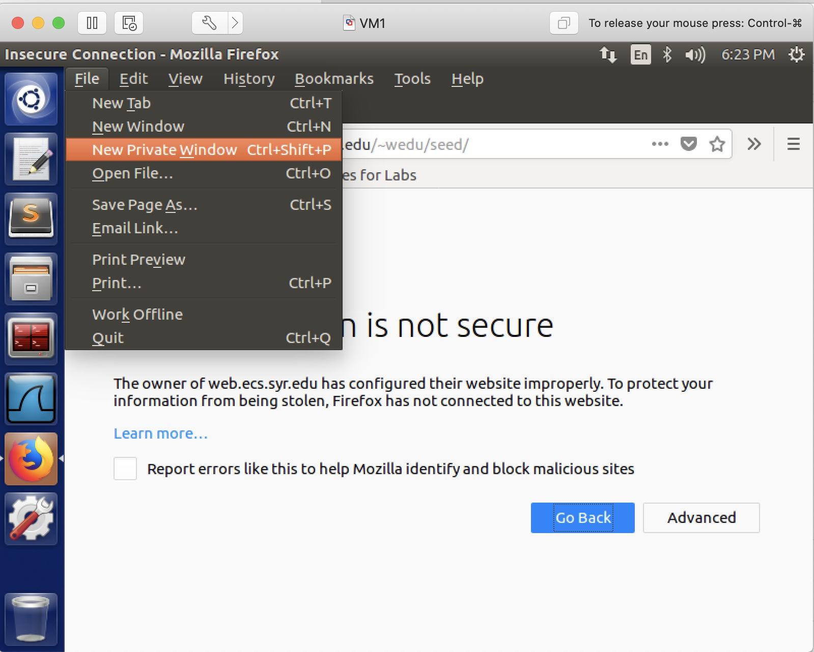
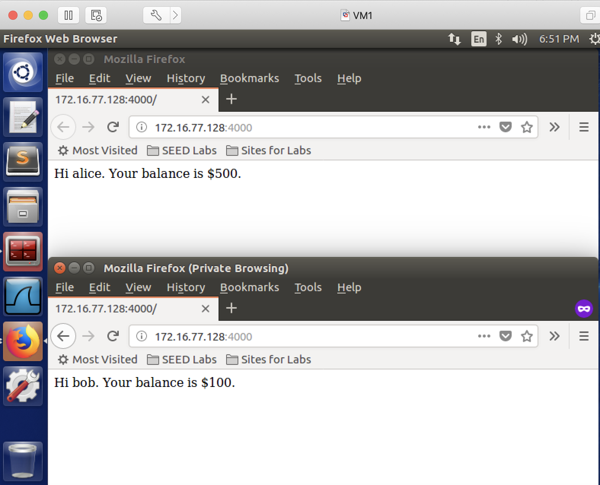
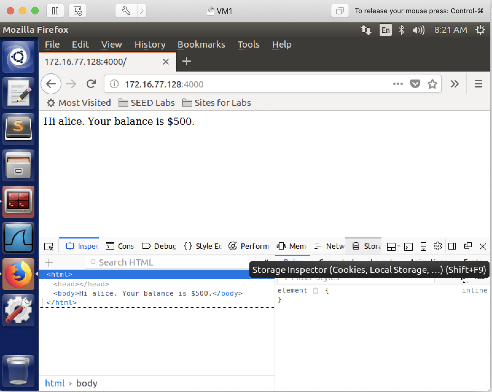
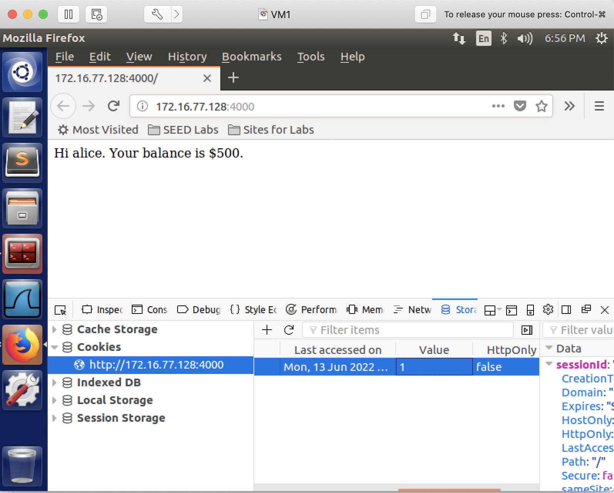
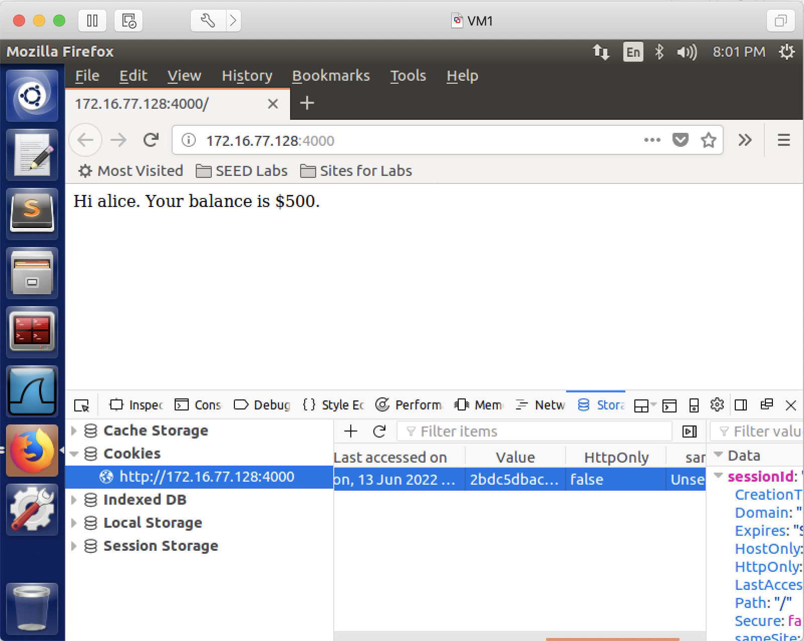

## HTTP Session Hijacking Attack

### Requirements 

In this lab, we will learn, how to implement http sessions securely. First, we will see, when session id is not randomized, the attacker, without knowing the victim's password, will be able to find out the victim's bank account balance information; and then we will see, once session id is randomized, the same attack would fail.

### Setup

Only one VM is sufficient. We will run a web server in this VM. The web server runs an online banking website, the online banking website has two users: alice and bob. The following is their username and password.

|  Username |  Password  | Balance | Role     |
|-----------|------------|---------|----------|
|  alice    |  password  | $500    | attacker |
|  bob      |  50505     | $100    | victim   |

### Steps

#### Preparation Steps

1. install *node*:

```console
$ sudo apt install nodejs
$ sudo apt install npm
$ npm config set strict-ssl false
$ npm install express
$ npm install cookie-parser
$ npm install body-parser
```

**Note**: if the above *npm* commands give you the following warnings, ignore them. It's not a problem.

```console
npm WARN enoent ENOENT: no such file or directory, open '/home/seed/package.json'
npm WARN seed No description
npm WARN seed No repository field.
npm WARN seed No README data
npm WARN seed No license field.
```

2. setup the web server:

```console
$ mkdir web 
$ cd web/
$ wget http://ns.cs.rpi.edu/labs/session/index.html
$ wget http://ns.cs.rpi.edu/labs/session/server-insecure.js
$ wget http://ns.cs.rpi.edu/labs/session/server-secure.js
```

3. start the web server:
```console
$ node server-insecure.js
```

4. open two browser tabs: one in normal mode, the other in **private windows** mode. and in both of them, access the web server: type localhost:4000 (replace localhost with your VM's IP address). In one tab, login as alice, in the other tab, login as bob. 

this screenshot shows how we can open a private window:


this screenshot shows we login as alice in the normal mode window, and login as bob in the private window mode:


5. after login to the online banking site, alice can see her balance is $500. But can alice see bob's balance? let's try it without knowing bob's password, we can achieve this via modifying the cookies.

#### Attacking Steps

6. we, as alice, try to modify the cookie "sessionId". we change its value from *alice*'s session id to *bob*'s session id. the following screenshots show how we change it.

6.1. first, we right click in the firefox window, and select **Inspect Element**.


6.2. next, we select **Storage**.


6.3. here, we can see cookies, and there is only one cookie, whose name is *sessionId*. let's choose this cookie.


6.4. this cookie has several attributes, such as *Name*, *Domain*, *Path*, *Last accessed on*, *Value*. at this moment, as we can see, the *Value* is **1**.


6.5. now that alice's session id is 1, can we take a guess and see if bob's session id is 2? let's change the value to 2 and hope that would be bob's session id.


7. refresh the web page, and we should see bob's account balance, which is $100.


this shows that the attack is successful: alice doesn't know bob's password, but she now still can see bob's bank account balance.

### Randomize session id

8. press ctrl-c to stop the web server - which we started in step 3. and run the secure version of the server, which produces randomized session id(s).

```console
$ node server-secure.js
```

9. refresh the two opening tabs (one for alice, one for bob): we will be asked to login again. login as alice and bob.

10. repeat 6 and 7 and see if the attack still works, it shouldn't, because, as we can see from this screenshot, the session id is not randomized and we, as alice, have no idea what would be bob's session id.



### Lesson we learn

The lesson we learn from this lab is when implementing session id(s), we should avoid using predictable numbers, rather they should be randomized and not predictable.

### Questions

What is the major difference between the attack presented in this lab and the attack presented in the [Insecure HTTP Cookies](../cookies) lab? The two labs are highly similar to each other, but which one requires the victim to have an active (authenticated) session?

### References

CS253 Web Security – course created and taught by Feross Aboukhadijeh at Stanford University.
