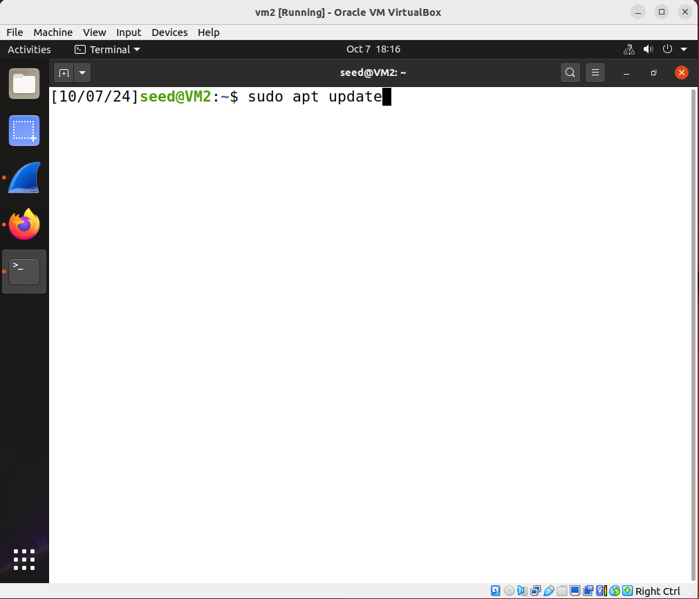
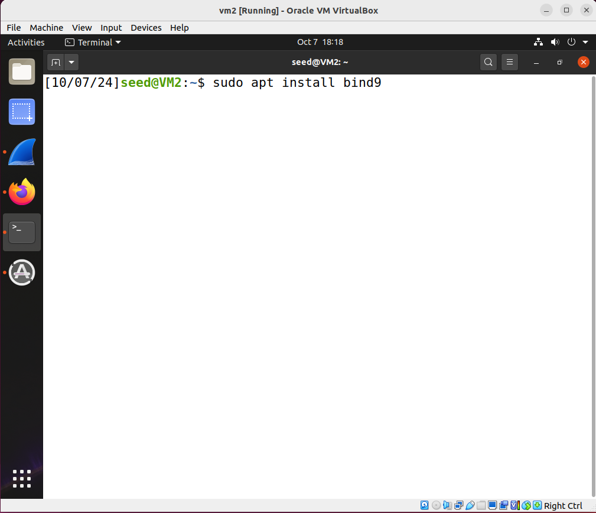
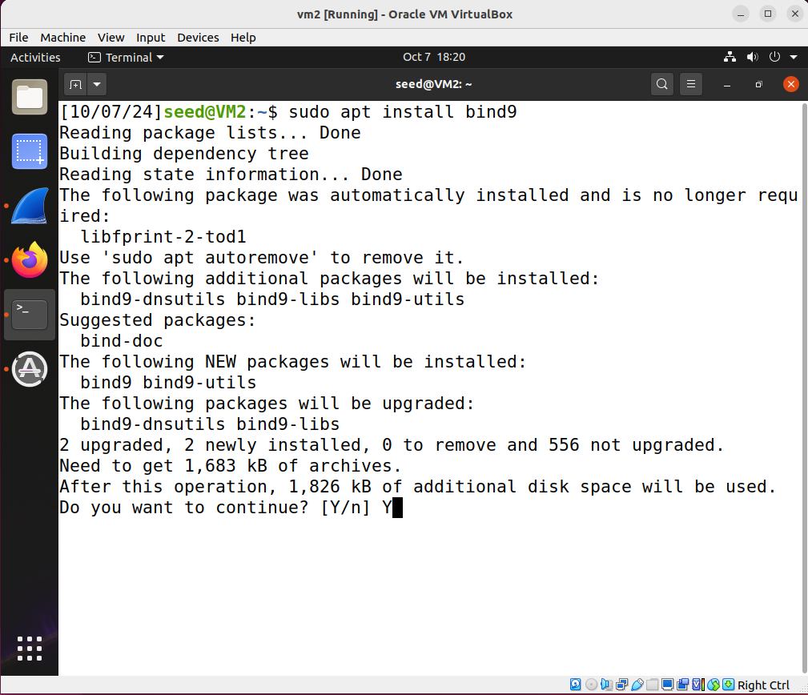
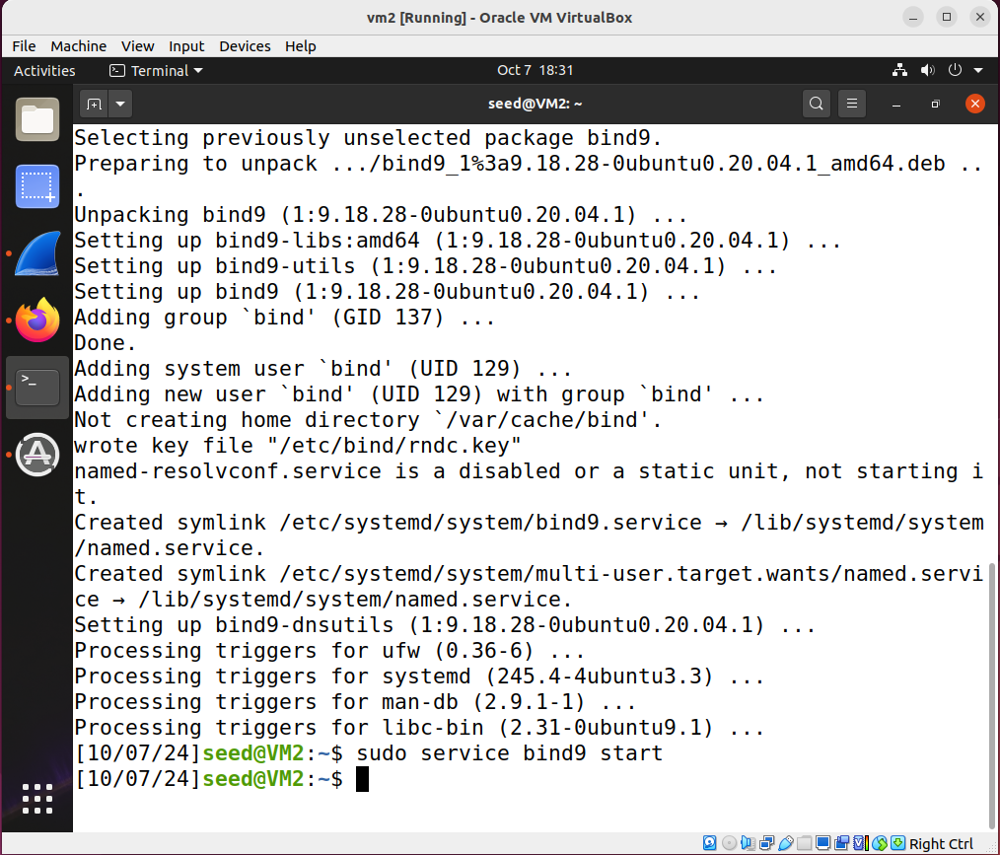
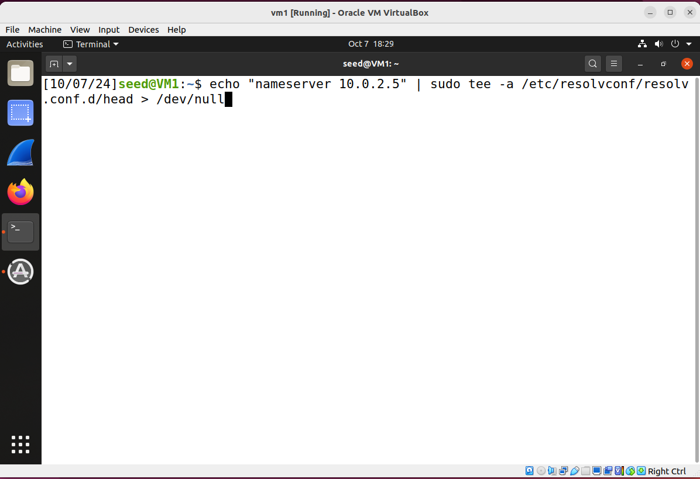
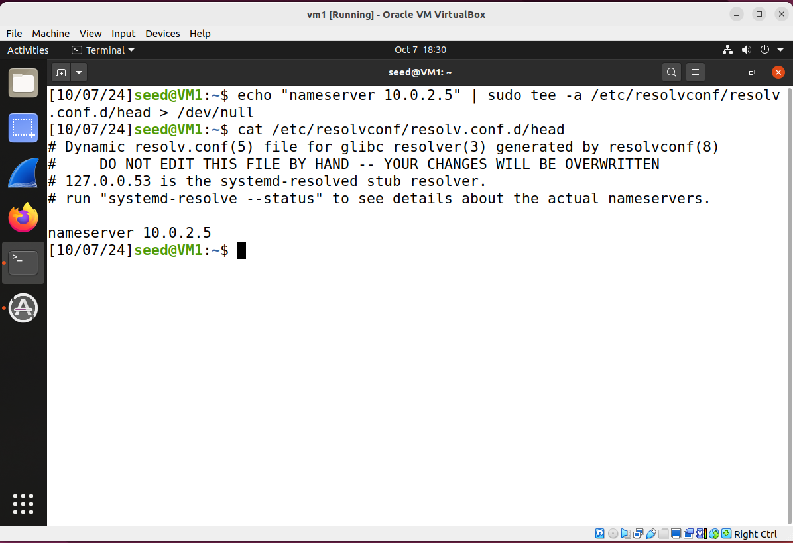
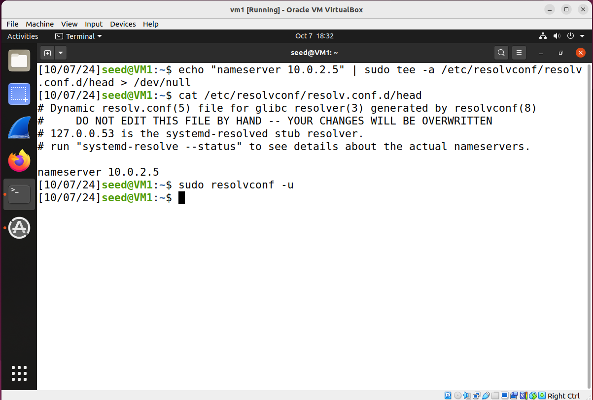
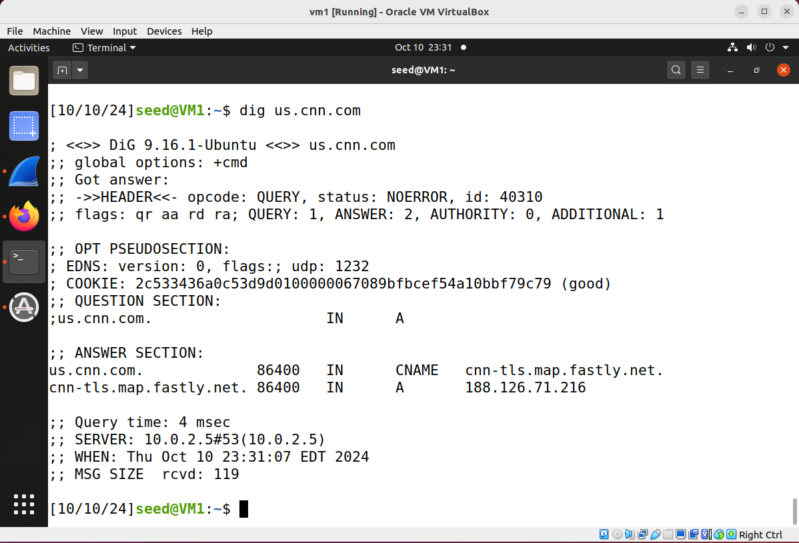
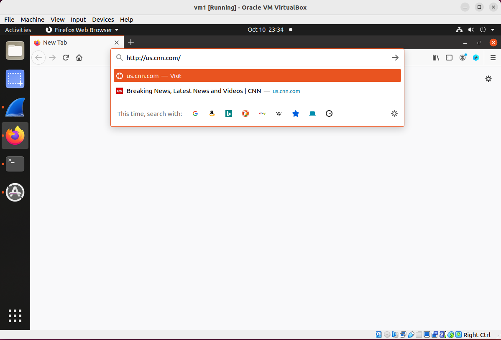
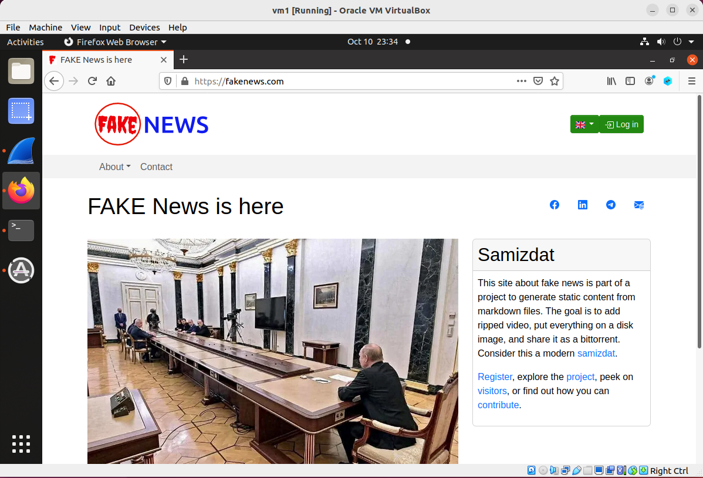

## Subdomain Takeover

### Background

Subdomain takeover is a security vulnerability that occurs when an attacker gains control of a subdomain that is still pointing to an external service (e.g., cloud hosting platforms like AWS, Azure, GitHub Pages) that has been deprovisioned but the DNS record is still configured. This allows the attacker to host content on the subdomain, potentially leading to malicious activities, such as phishing or spreading malware.

Read the notes [here](https://github.com/jidongxiao/networksecurity/tree/main/notes/subdomain_takeover) to have a better understanding of the attack.

### Requirement

In this lab, we will study the vulnerability of subdomain takeover and its consequence. At the end of the lab, the victim client who visits us.cnn.com will now go to fakenews.com.

### Setup

3 Linux VMs: Victim Client, DNS Server 1, DNS Server 2.

The following is the IP addresses for the VMs used in this README.

| VM  |  IP Address   |        Role                                                           |
|-----|---------------|-----------------------------------------------------------------------|
| VM1 | 10.0.2.4      |   victim client                                                       |
| VM2 | 10.0.2.5      |   dns server 1: serve as the authoritative name server of cnn.com     |
| VM3 | 10.0.2.6      |   dns server 2: serve as the authoritative name server of fastly.com  |

### Preparation

We assume that in previous lab, you have already installed bind9 on VM2. If you did not, install bind9 now, but this time install it on both VM2 and VM3, since in this lab we have two DNS servers.

1.1. on VM2: run theses commands to install the DNS server software - we will use BIND software. (BIND: Berkeley Internet Name Domain) 

```console
$ sudo apt update
$ sudo apt install bind9
```

these screenshots shows the commands to install the server.






1.2. Repeat step 1.1 on VM3.

2. Set up the DNS servers:

2.1. On VM2, copy the 4 files in [this folder](cnn) to the /etc/bind/ directory on VM2. Out of these 4 files, you need to change 2 of them:

Change the file *db.cnn.com*:

```console
ns          IN    A     10.0.2.5
```

Change 10.0.2.5 to the IP address of your VM2.

Change the file *named.conf*:

```console
forwarders { 10.0.2.6; };
```

Change 10.0.2.6 to the IP address of your VM3.

2.2. On VM3, copy the 2 files in this [folder](fastly) to the /etc/bind/ directory on VM3. Out of these 2 files, you need to change 1 of them:

Change the file *db.fastly.net*: 

```console
ns          IN    A     10.0.2.6
```

Change 10.0.2.6 to the IP address of your VM3.

3. on VM2 and VM3: run this command to start the DNS service: 

```console
$ sudo service bind9 start
```

this screenshot shows the commands to start the server.



4. on victim client, configure DNS server information, 

4.1. run this following command, which adds a line to the end of file /etc/resolvconf/resolv.conf.d/head. The added line will tell the client the IP address of the DNS server, in this README, it is 10.0.2.5, and as you run the command you should change 10.0.2.5 to the IP address of your DNS server.

```console
$ echo "nameserver 10.0.2.5" | sudo tee -a /etc/resolvconf/resolv.conf.d/head > /dev/null
```

this screenshot shows the command:


4.2 after running the above command, we can use *cat* to confirm that line is added to the file /etc/resolvconf/resolv.conf.d/head:

```console
$ cat /etc/resolvconf/resolv.conf.d/head
```

this screenshot shows that the line is indeed added to the end of the file:


4.3. run the following command so the above change in that file will take effect:

```console
$ sudo resolvconf -u
```



### Test

1. After all the setup, let's test your configuration is correct. On VM3, run this:

```console
$ dig @localhost cnn-tls.map.fastly.net

; <<>> DiG 9.18.28-0ubuntu0.20.04.1-Ubuntu <<>> @localhost cnn-tls.map.fastly.net
; (1 server found)
;; global options: +cmd
;; Got answer:
;; ->>HEADER<<- opcode: QUERY, status: NOERROR, id: 53705
;; flags: qr aa rd ra; QUERY: 1, ANSWER: 1, AUTHORITY: 0, ADDITIONAL: 1

;; OPT PSEUDOSECTION:
; EDNS: version: 0, flags:; udp: 1232
; COOKIE: 6f051e145c20072d0100000067089481f2daf316a5b97033 (good)
;; QUESTION SECTION:
;cnn-tls.map.fastly.net.		IN	A

;; ANSWER SECTION:
cnn-tls.map.fastly.net.	86400	IN	A	151.101.3.5

;; Query time: 0 msec
;; SERVER: 127.0.0.1#53(localhost) (UDP)
;; WHEN: Thu Oct 10 22:59:13 EDT 2024
;; MSG SIZE  rcvd: 95
```

Your result should show (in the ANSWER SECTION) that cnn-tls.map.fastly.net. is mapped to the IP address of 151.101.3.5, this is the correct IP address of us.cnn.com. This result will confirm that your VM3 configuration is correct. DO NOT proceed if your VM3 configuration is not correct.

2. now on VM2, run this:

```console
$ dig @localhost us.cnn.com

; <<>> DiG 9.18.28-0ubuntu0.20.04.1-Ubuntu <<>> @localhost us.cnn.com
; (1 server found)
;; global options: +cmd
;; Got answer:
;; ->>HEADER<<- opcode: QUERY, status: NOERROR, id: 40107
;; flags: qr aa rd ra; QUERY: 1, ANSWER: 2, AUTHORITY: 0, ADDITIONAL: 1

;; OPT PSEUDOSECTION:
; EDNS: version: 0, flags:; udp: 1232
; COOKIE: cb54ce20d23cd8e20100000067089578fcead7012b115197 (good)
;; QUESTION SECTION:
;us.cnn.com.			IN	A

;; ANSWER SECTION:
us.cnn.com.		86400	IN	CNAME	cnn-tls.map.fastly.net.
cnn-tls.map.fastly.net.	86400	IN	A	151.101.3.5

;; Query time: 24 msec
;; SERVER: 127.0.0.1#53(localhost) (UDP)
;; WHEN: Thu Oct 10 23:03:20 EDT 2024
;; MSG SIZE  rcvd: 119
```

Your result should show (in the ANSWER SECTION) that:

- First, us.cnn.com. has a CNAME record which points to cnn-tls.map.fastly.net.

- Second, cnn-tls.map.fastly.net. is mapped to the IP address of 151.101.3.5, this is the correct IP address of us.cnn.com. This result will confirm that your VM2 configuration is correct. DO NOT proceed if your VM2 configuration is not correct.

3. on VM1, run this:

```console
$ dig us.cnn.com

; <<>> DiG 9.16.1-Ubuntu <<>> us.cnn.com
;; global options: +cmd
;; Got answer:
;; ->>HEADER<<- opcode: QUERY, status: NOERROR, id: 45761
;; flags: qr aa rd ra; QUERY: 1, ANSWER: 2, AUTHORITY: 0, ADDITIONAL: 1

;; OPT PSEUDOSECTION:
; EDNS: version: 0, flags:; udp: 1232
; COOKIE: a9206db8dbb43443010000006708962d6d8fea9beba420ef (good)
;; QUESTION SECTION:
;us.cnn.com.			IN	A

;; ANSWER SECTION:
us.cnn.com.		86400	IN	CNAME	cnn-tls.map.fastly.net.
cnn-tls.map.fastly.net.	86219	IN	A	151.101.3.5

;; Query time: 0 msec
;; SERVER: 10.0.2.5#53(10.0.2.5)
;; WHEN: Thu Oct 10 23:06:21 EDT 2024
;; MSG SIZE  rcvd: 119
```

Your result should show (in the ANSWER SECTION) that:

- First, us.cnn.com. has a CNAME record which points to cnn-tls.map.fastly.net.

- Second, cnn-tls.map.fastly.net. is mapped to the IP address of 151.101.3.5, this is the correct IP address of us.cnn.com. This result will confirm that your VM1 has been successfully configured to use VM2 as its DNS server. DO NOT proceed if your VM1 configuration is not correct.

### Attack

1. on VM3, edit this file: */etc/bind/db.fastly.net*, change these two lines:

```console
;cnn-tls.map IN    A     188.126.71.216  
cnn-tls.map IN    A     151.101.3.5
```

uncomment the first line and comment the second line. Note that in these DNS configuration files, we can comment a line by using a semicolon (;). Anything after the semicolon on the same line will be ignored by the BIND DNS server.

2. on VM2, run this command flush DNS cache - so that we don't use the old mapping, which maps us.cnn.com to its real IP address, which is 151.101.3.5.

```console
$ sudo rndc flush
```

3. on victim client, send a DNS query.

```console
$ dig www.cnn.com 
```

this screenshot shows the attack is successful: www.cnn.com is mapped to 188.126.71.216, which is the IP address of fakenews.com.


4. on victim client, open firefox, and enter http://us.cnn.com.

these two screenshots once again show that the attack is successful: the victim who attempts to visit www.cnn.com, is now taken to the page of fakenews.com.



Both step 2 and step 3 here proves that the attack is successful, and this concludes the lab.

### Clean up

You are recommended to remove the line you added in the preparation steps, in this file: /etc/resolvconf/resolv.conf.d/head, so that your future experiments won't be affected.

You will need *sudo* to edit the file. If you are not comfortable of using a command-line editor, you can use this command, which removes the last line of the file, and the line we added in that file indeed is the last line.

```console
$ sudo sed -i '$d' /etc/resolvconf/resolv.conf.d/head
```
