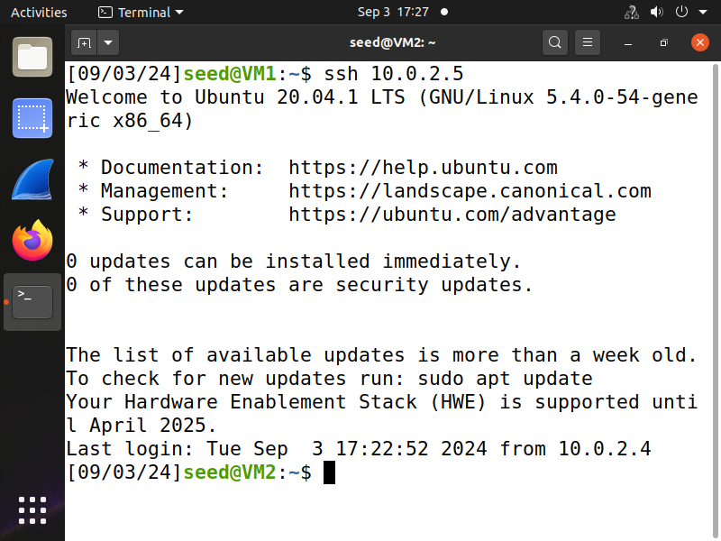
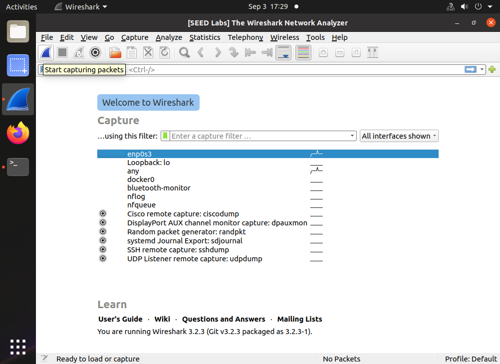
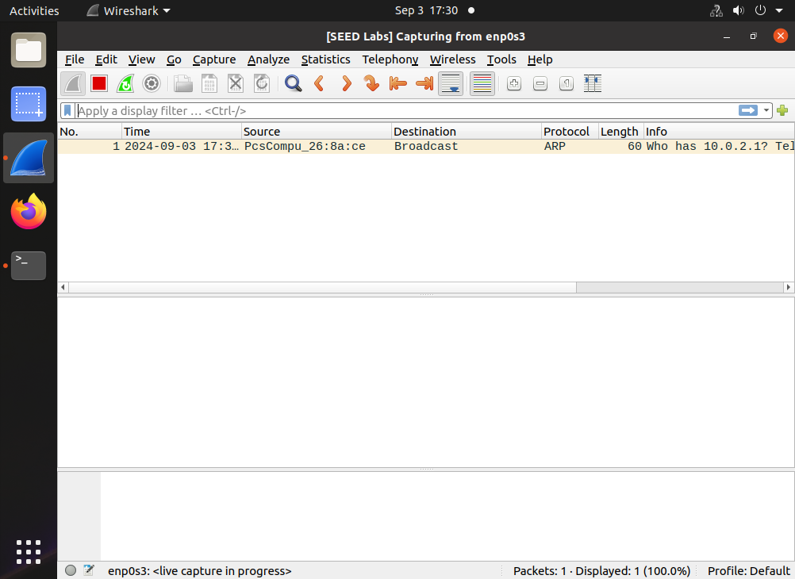
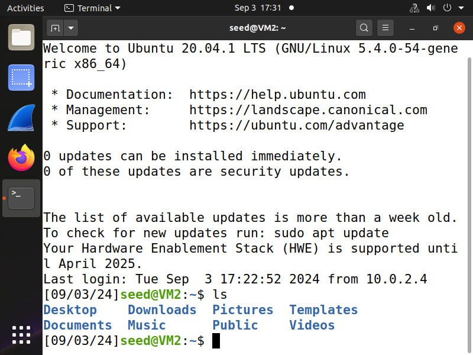
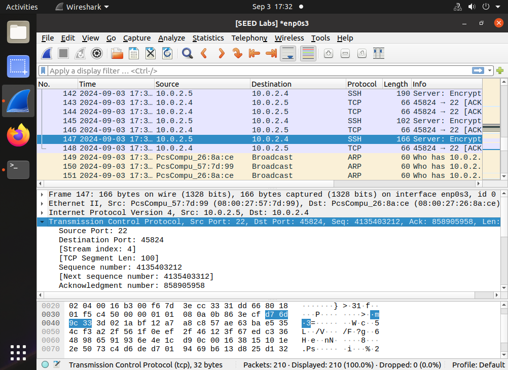
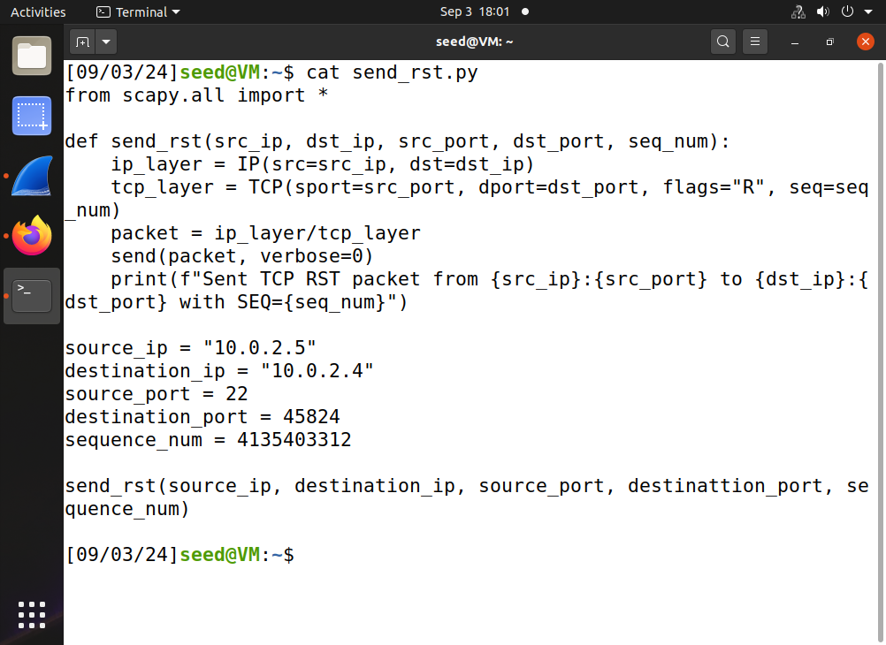
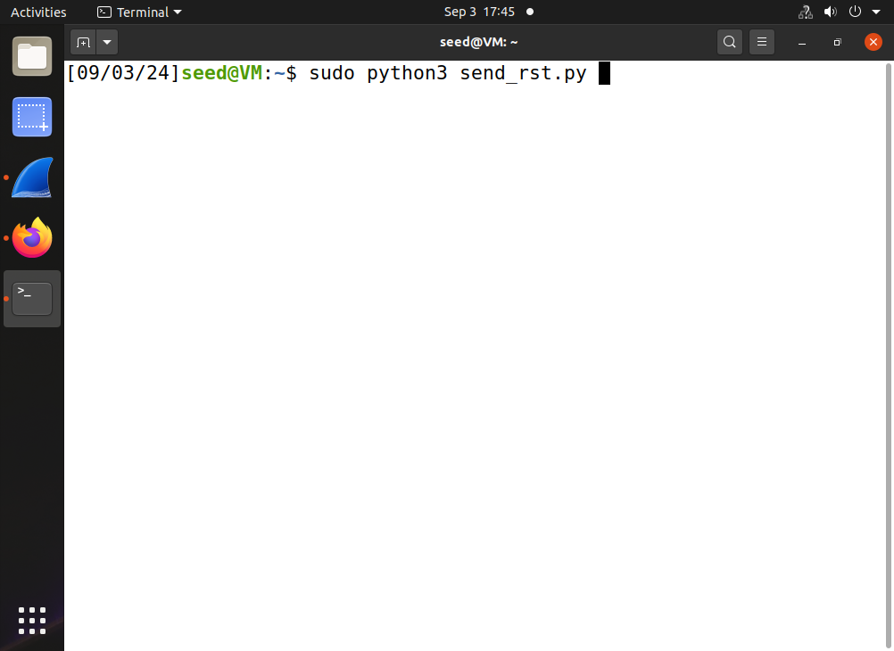
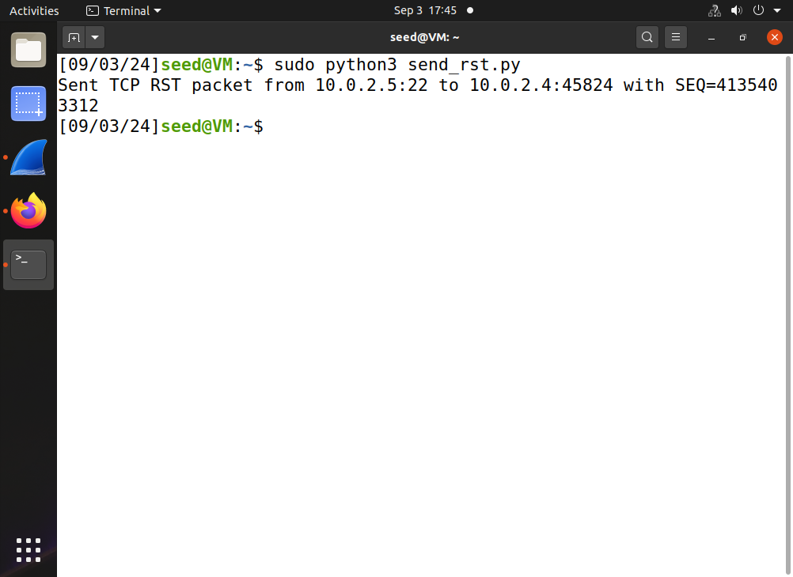
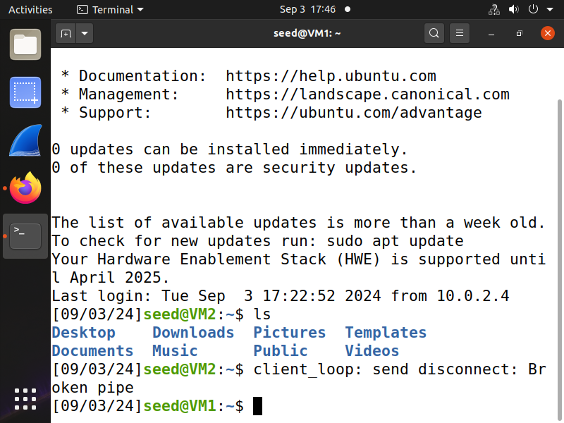

## TCP Reset Attack

### Requirements 

In this lab, we will break an ssh connection between the victim client and the ssh server.

### Setup

3 Linux VMs. VM1 as the victim (ssh client); VM2 as the ssh server; VM3 as the attacker. The 3 VMs reside in the same network.

In addition, make sure the python module scapy is installed in the attacker VM. If not, run this command to install scapy:

```console
# sudo apt update
# sudo apt install python3-scapy
```

### Steps

1. let the client connect to the server using ssh.



2. let the attacker start monitoring network traffic using wireshark.




3. client produces some ssh packets. (any ssh packets, you can just type a command like ls).



4. attacker stops wireshark capturing, and navigates to the latest packet sent from the server to the client.



5. the above packet provides the information which the attacker needs to know in order to perform the tcp reset attack. now, the attacker, mimicking the server, only needs to send one single RST packet to the client. To send a TCP reset packet, a python script named [send_rst.py](send_rst.py) is provided. When running this script, it will send a TCP reset packet to a destination. You need to change the script so that the following five lines match with your situation.

```console
source_ip = "10.0.2.5"
destination_ip = "10.0.2.4"
source_port = 22
destination_port = 12345
sequence_num = 1000
```

**Note**, because the attacker is mimicking the server, the source_ip should be the IP address of the server, the destination_ip should be the IP address of the client, the source_port should be 22 since ssh server uses port 22, the destination port and the sequence number are the two pieces which need to be found in wireshark.

from the above wireshark screenshot, we can see the destination port is 45824, and the sequence number needs to be the *next sequence number* as seen in wireshark: as we can see from wireshark, the *next sequence number* is *4135403312*. With these two piece of information, we update the script:

- updated script:


Once all five lines are correct, we can now run this script:

- before pressing enter:


- after pressing enter:


6. once the attacker pressed enter to execute the above script, if the attack is successful, the victim client's ssh connection will be disrupted, and the victim client is expected to see this on the terminal:



This indicates that the attack is successful and concludes the lab. The client is no longer connected to the ssh server.
