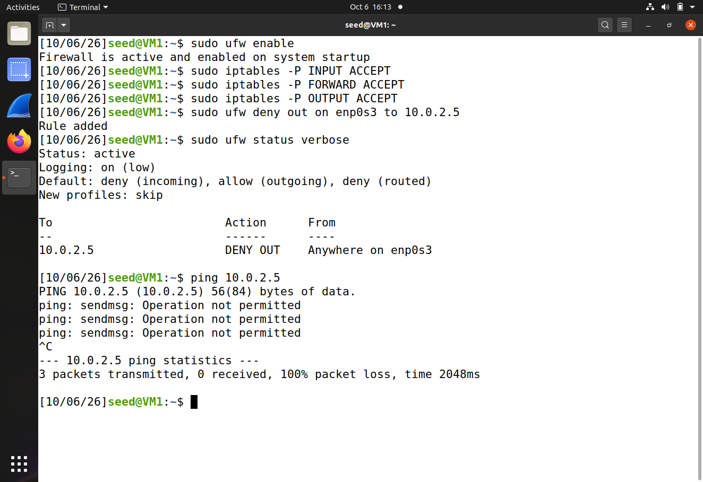
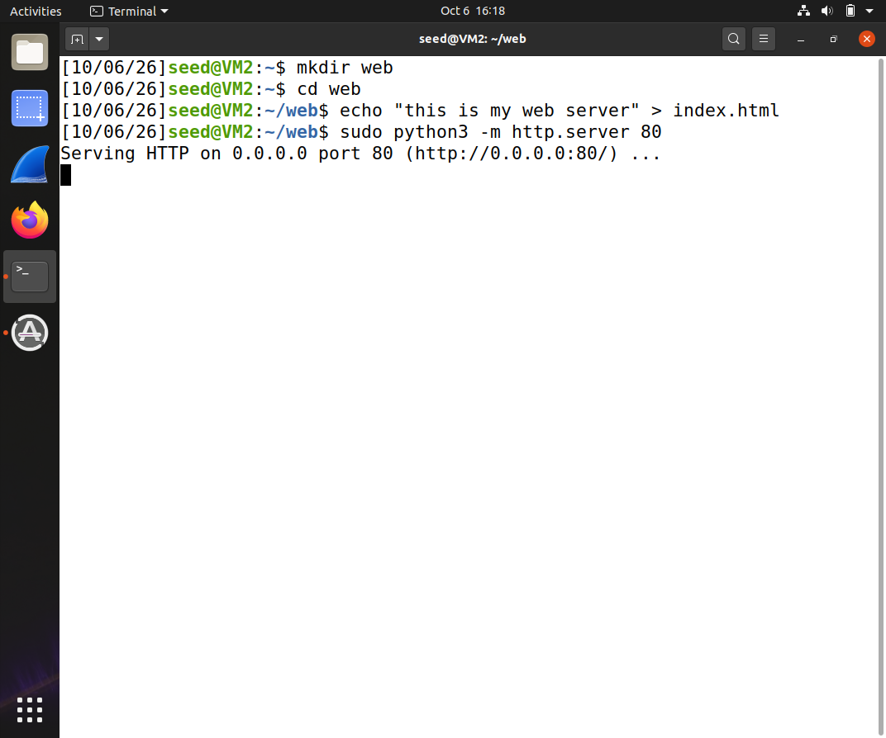
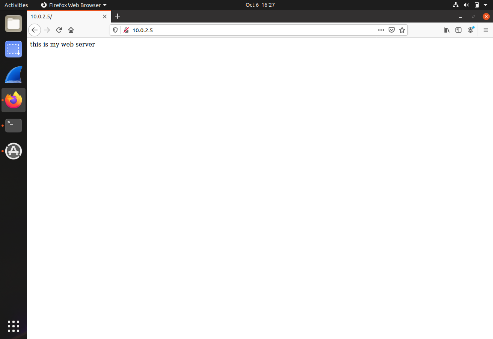
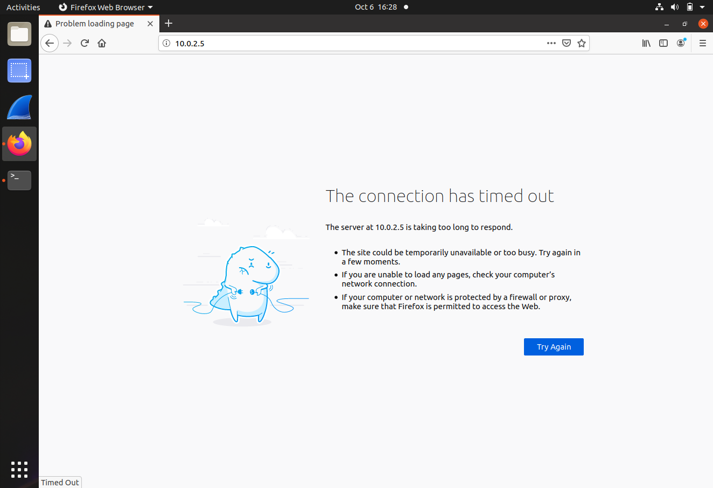
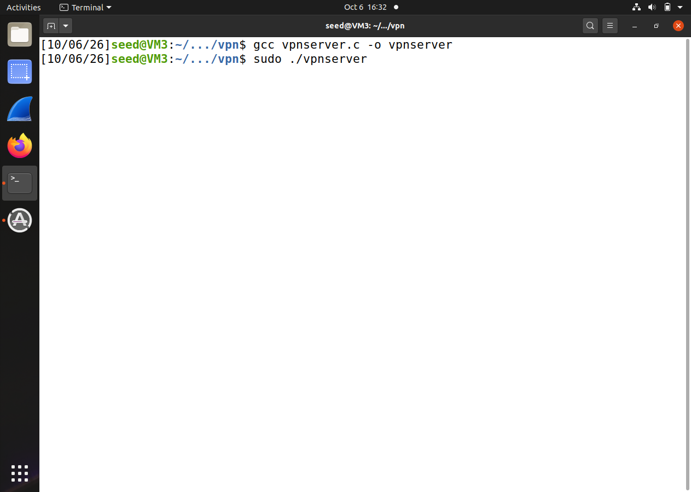
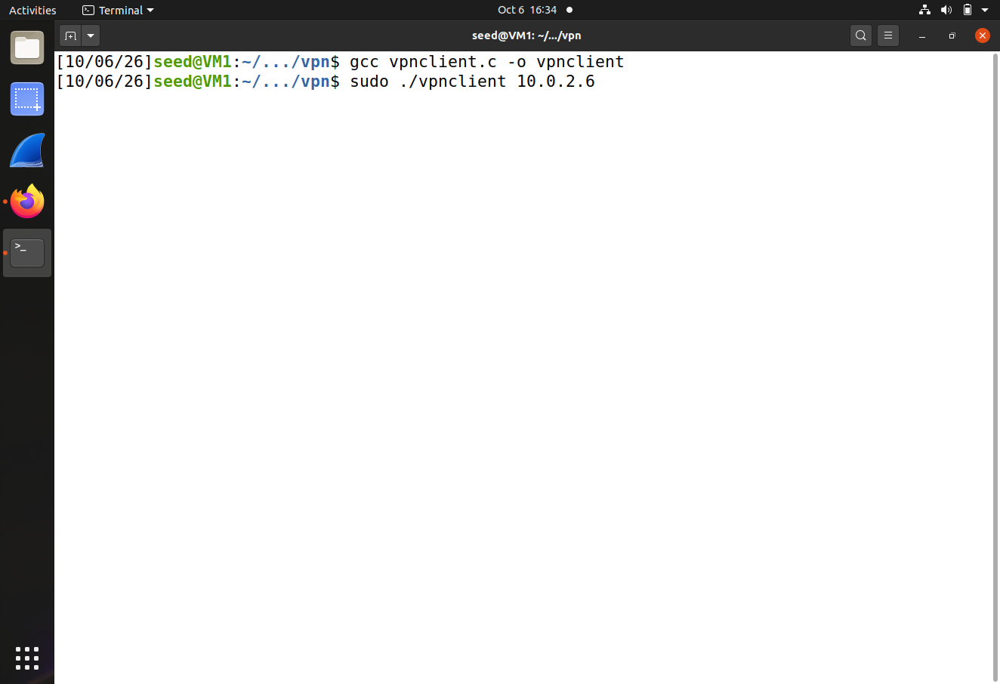
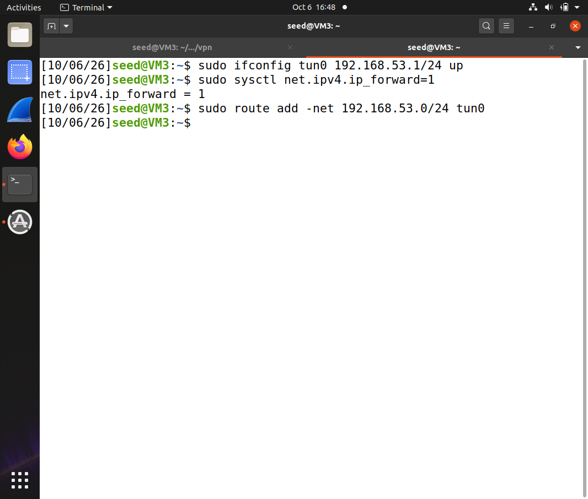
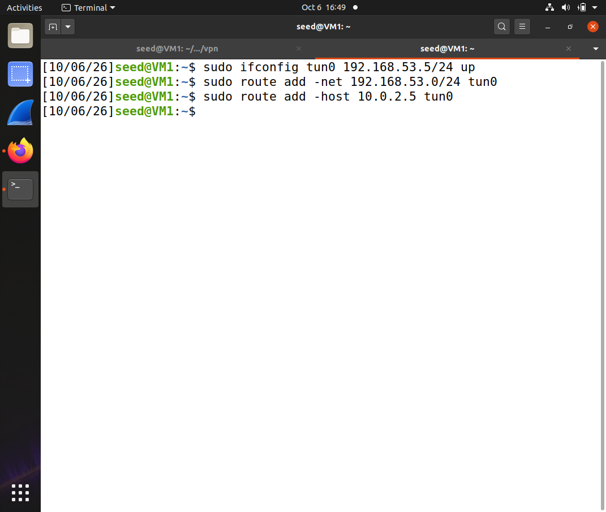
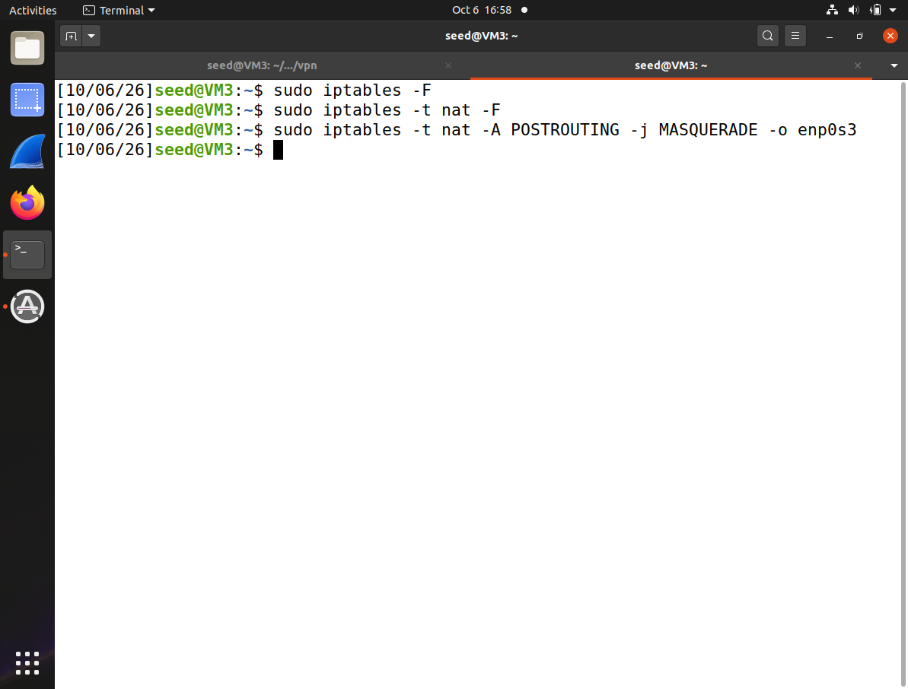
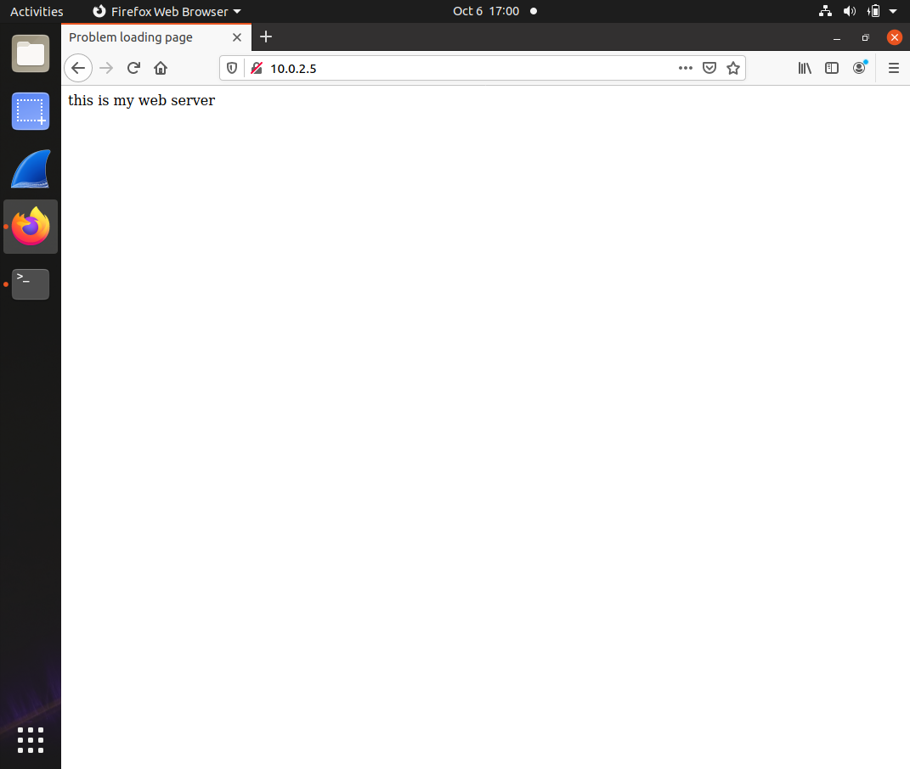

## Bypass Firewall Using VPN

### Requirement

In this lab, you will bypass a firewall that has an egress filtering rule, which blocks VM1 from accessing the web server running on VM2.

### Setup

3 Linux VMs: VM1, VM2. Firewall runs on VM1. VM1 serves as VPN client, VM2 serves as web server, VM3 serves as the VPN server.

| VM  |  IP Address   |                Role               | Default Network Interface Card |
|-----|---------------|-----------------------------------|--------------------------------|
| VM1 | 10.0.2.4 |  VPN client, Web client, also runs firewall   |            enp0s3               |
| VM2 | 10.0.2.5 |  Web server                       |            enp0s3               |
| VM3 | 10.0.2.6 |  VPN server                       |            enp0s3               |

### Steps

1. enable firewall on VM1, and let all default policy be ACCEPT.

```console
# sudo ufw enable
# sudo iptables -P INPUT ACCEPT
# sudo iptables -P FORWARD ACCEPT
# sudo iptables -P OUTPUT ACCEPT
```

**Explanation**: When the default policy is set to ACCEPT, all traffic are allowed unless there are more specific rules blocking certain traffic.

2. setup the firewall on VM1 so that VM2 (the web server) is blocked.

```console
# sudo ufw deny out on enp0s3 to 10.0.2.5
```

**Note**: if your VM's NIC is not enp0s3, change enp0s3 here to your NIC's name. You need to do so for all remaining steps - replace enp0s3 with your NIC's name whenever you see enp0s3 in this lab.

**Note 2**: replace 10.0.2.5 with your VM2's IP address.

3. you can use this command to verify your setting is correct:

```console
# sudo ufw status verbose
# ping 10.0.2.5
```

ping should fail here because of the above firewall setting:



4.1. start a web server on VM2.

```
# mkdir web
# cd web
# echo "this is my web server" > index.html
# sudo python3 -m http.server 80
``` 

this screenshot shows setting up the web server on VM2.



and you should be able to access the web server from VM2 using the browser:



4.2. open the firefox browser on VM1 and try to access VM2 (http://10.0.2.5) - you should fail - because of the above firewall setting:



5. On VM3 (the VPN server), download this [vpn server program](vpnserver.c), compile the vpn server program and run it.

```console
# gcc vpnserver.c -o vpnserver
# sudo ./vpnserver
```



6. on VM1: download the [vpn client program](vpnclient.c), compile the vpn client program and run it.

```console
# gcc vpnclient.c -o vpnclient
# sudo ./vpnclient server_ip // remember to replace server_ip with your VPN server's IP.
```

this screenshot shows when the client and server are connected, a hello message is printed on the server side.



7. on VM3 (the VPN server), open a new terminal and configure the tun interface; and then enable ip forwarding.

```console
# sudo ifconfig tun0 192.168.53.1/24 up
# sudo sysctl net.ipv4.ip_forward=1
```

**Explanation**: the first command sets up a tun0 interface, whose ip address is 192.168.53.1, whose subnet mask is 24, a.k.a., 255.255.255.0; the second command turns on ip forwarding.

8. still on VM3 (the VPN server), set up a routing rule for the 192.168.53.0/24 network.

```console
# sudo route add -net 192.168.53.0/24 tun0
```

**Explanation**: this command adds a routing rule to the system saying that any traffic goes to 192.168.53.0/24 should go through the network interface tun0; without this routing rule, such traffic will go through the default network interface card.



9. on VM1, open a new terminal and configure the tun interface.

```console
# sudo ifconfig tun0 192.168.53.5/24 up
```

**Explanation**: this command sets up a tun0 interface, whose ip address is 192.168.53.5, whose subnet mask is 24, a.k.a., 255.255.255.0.

10. still on VM1, set up a routing rule for the 192.168.53.0/24 network. Also add another routing rule for packets destined to VM2 (10.0.2.5) to be sent through the tunnel.

```console
# sudo route add -net 192.168.53.0/24 tun0
# sudo route add -host 10.0.2.5 tun0
```

this screenshot shows all of the above ifconfig, and route commands:



Remember to replace 10.0.2.5 with the IP address of your VM2 (the web server).

11. now, at this moment, if on VM1, you ping VM2 (10.0.2.5), you ping packets will go to VM2, but you won't be able to get the responses. in order to see the responses, we need to setup NAT on the VPN server, i.e., VM3.

```console
# sudo iptables -F		// Flush existing iptables rules.
# sudo iptables -t nat -F	// Flush existing iptables rules in the nat table.
# sudo iptables -t nat -A POSTROUTING -j MASQUERADE -o enp0s3
```



Explanation of the above iptables command:

-t nat	 	select table "nat" for configuration of NAT rules. iptables defines several tables, table "filter" is the default table, which is for configuring firewall rules; table "nat" is for configuring NAT rules.

-A POSTROUTING	append a rule to the POSTROUTING chain (The NAT table contains PREROUTING chain, POSTROUTING chain, and OUTPUT chain). the PREROUTING chain is responsible for packets that just arrived at the network interface; whereas the POSTROUTING chain is responsible for packets that are about to leave this machine.

-o enp0s3	this rule is valid for packets that leave on the network interface enp0s3 (-o stands for "output")

-j MASQUERADE	the action that should take place is to 'masquerade' packets, i.e. replacing the sender's address with the NAT server's address.

Overall, this command says, when forwarding packets, replace the sender's address with this current VM's ip address (the address that is associated with ens33).

12. On VM1, use the firefox browser to access VM2 (http://10.0.2.5) - this time you should succeed, as shown in the screenshot:



thus the lab is successful.

13. once again, you're recommended to reset your firewall on VM1 and NAT on VM3, so they don't affect your future experiments:

on VM1:
```console
# sudo ufw reset
# sudo ufw disable
# sudo ufw status verbose
```

on VM3:
```console
# sudo iptables -t nat -F
# sudo iptables -t nat -L
```

**Troubleshooting tips**:

If the lab worked smoothly for you, you can ignore the following part. If at the end of the lab you just are not able to access the web server, one thing you can do is, run these 3 commands on the VPN server side (VM3) as well:

```console
# sudo iptables -P INPUT ACCEPT
# sudo iptables -P FORWARD ACCEPT
# sudo iptables -P OUTPUT ACCEPT
```

Technically we should not need to run these 3 commands on the VPN server, since we do not intend to have a firewall on the VPN server for any purpose. However, the provided VM may run the firewall secretly by default, and its default policy may be DROP, and when that is the case, then your packets may be dropped at the VPN server and would not reach its final destination. These commands set the default policy to be ACCEPT, this way even if the firewall on the VPN server VM runs, it won't block any of your packets.
