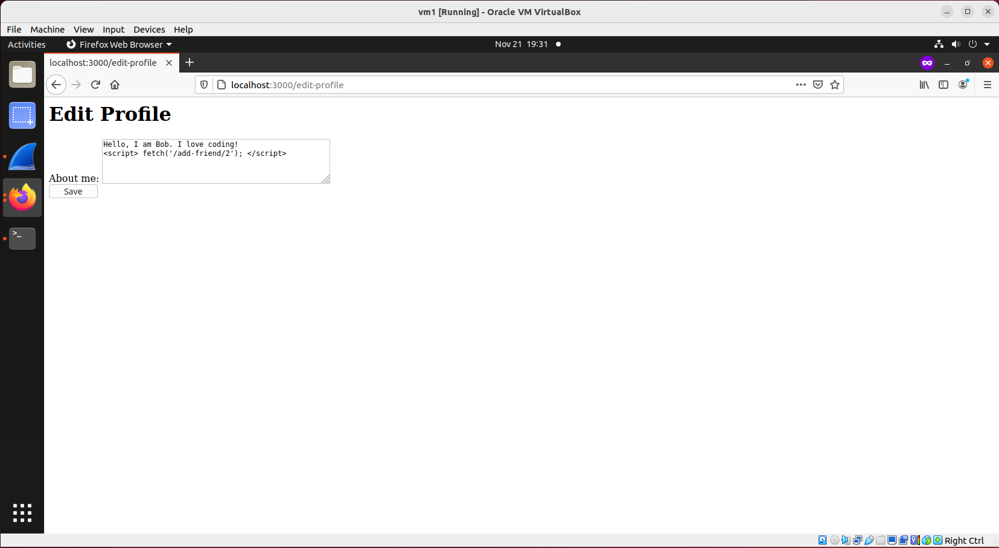

## Cross-site Scripting (XSS Attack)

### Requirements 

In this lab, we will work on a social network website. An attacker, who is also a user on this website, injects a javascript into its profile, and when a victim visits the attacker's profile page, the injected javascript executes and the attacker gets added to the victim's friend list.

### Setup

Only one VM is sufficient. Source code for the social network website is provided and the website contains the following users:

|  Username |  Password   |  Role    |
|-----------|-------------|----------|
|  Alice    |  password1  | victim   |
|  Bob      |  password2  | attacker |
|  Samy     |  password3  |          |
|  Charlie  |  password4  |          |
|  Dana     |  password5  |          |

### Steps

1. Install node:

```console
$ sudo apt install nodejs
$ sudo apt install npm
$ npm install ejs	// pay attention here, this ejs is a new package which is unique to this lab.
$ npm config set strict-ssl false
$ npm install express
$ npm install cookie-parser
$ npm install body-parser
```

2. Set up the social network website:

```console
$ mkdir xss
$ cd xss/
$ wget http://ns.cs.rpi.edu/labs/xss/server.js
$ wget http://ns.cs.rpi.edu/labs/xss/index.ejs
$ wget http://ns.cs.rpi.edu/labs/xss/login.ejs
$ wget http://ns.cs.rpi.edu/labs/xss/profile.ejs
$ wget http://ns.cs.rpi.edu/labs/xss/edit-profile.ejs
```

- start the social network webserver:
```console
$ node server.js
```

3. Open two browser tabs: one in normal mode, the other in **private window** mode. In both of them, access the web server: type localhost:3000. In one tab, login as alice, in the other tab, login as bob.


4. Bob adds this script into his profile:

```console
<script> fetch('/add-friend/2'); </script>
``` 

Please refer to these screenshots to make sure you are adding the right content into Bob's profile:




5. At this moment, any user who visits Bob's profile page will add Bob as the friend. To test this, let Alice visit Bob's profile page, which is located at [http://localhost:3000/user/2](http://localhost:3000/user/2).


6. Alice clicks the button to go back to her own profile, and now she sees that Bob is on her friends list. As can be seen from the this screenshot, which proves that the attack is successful, and this concludes the lab.

